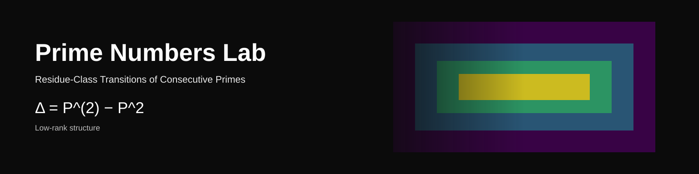

# Prime Numbers Lab — Residue-Class Transitions of Consecutive Primes



📄 **Paper:** [`paper/main.pdf`](paper/main.pdf)  
📘 **Overview:** [`docs/overview.md`](docs/overview.md)  
📊 **Figures:** [`figures/`](figures/)  

---

## Summary

Reducing consecutive primes modulo 30 yields a sequence over 8 residue states:

{1, 7, 11, 13, 17, 19, 23, 29}

From this sequence, we construct a transition operator \(P\) and define:

\[
\Delta = P^{(2)} - P^2
\]

The residual operator \(\Delta\) exhibits low-rank structure, providing a direct way to measure deviation from first-order models.

---

## Key idea

This work treats consecutive primes as a finite-state dynamical system:

- primes → residue sequence  
- transitions → operator \(P\)  
- second-order behavior → \(P^{(2)}\)  
- deviation → \(\Delta\)

\(\Delta\) serves as a compact, measurable object for analyzing higher-order structure in prime transitions.

---

## How to read

1. Read the paper: [`paper/main.pdf`](paper/main.pdf)  
2. View figures: [`figures/`](figures/)  
3. Use the overview for context: [`docs/overview.md`](docs/overview.md)  
4. Refer to definitions: [`docs/glossary.md`](docs/glossary.md)  

---

## Repository structure

```
paper/        # LaTeX source and compiled PDF
figures/      # publication-ready figures
src/          # core computations (P, P^(2), Δ, controls)
scripts/      # reproducibility (figure generation, pipeline)
notebooks/    # exploratory analysis
docs/         # overview, glossary, and connections
channel/      # presentation scripts (YouTube, Substack, talks)
```

---

## Reproducibility

Install dependencies:

```bash
pip install -r requirements.txt
```

Generate all figures:

```bash
python scripts/generate_figures.py
```

---

## Notes

This repository presents a computational representation and diagnostic:

- no new theorems are claimed  
- results are finite-sample and operator-based  
- focus is on measurable structure in \(\Delta\)

---

## Reference

If you use this work, cite the paper in [`paper/main.pdf`](paper/main.pdf).
