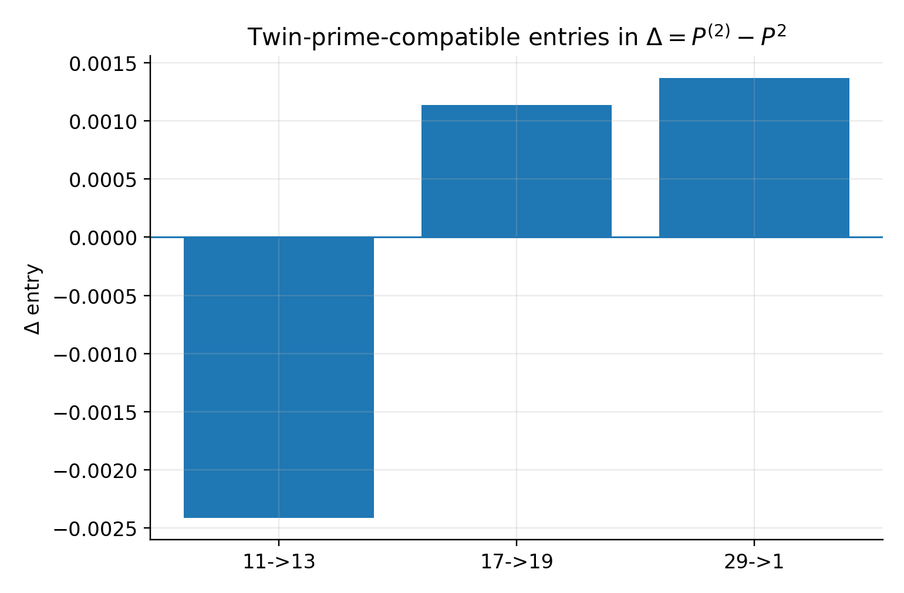
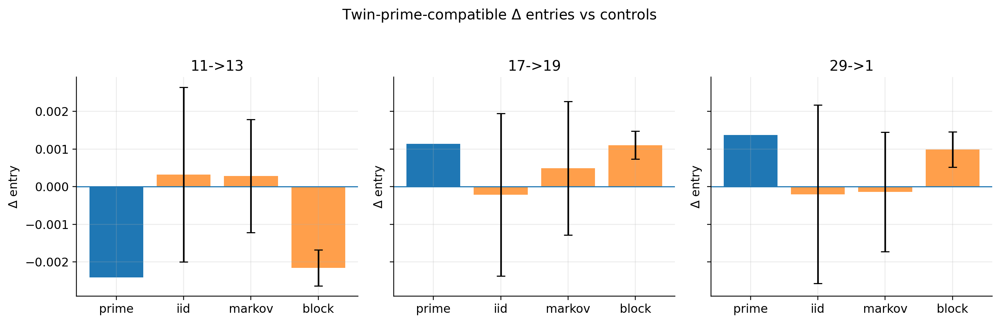
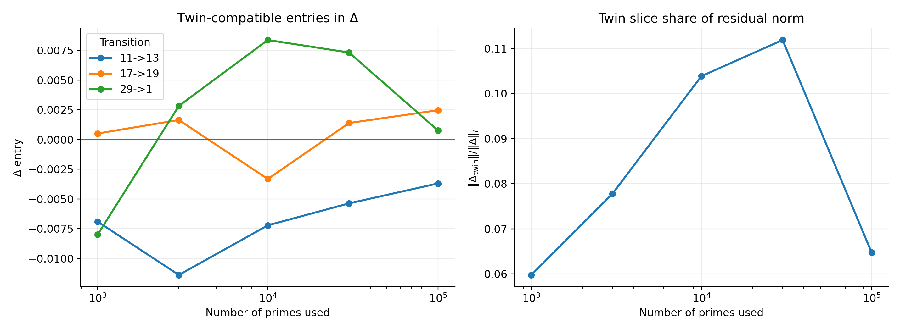

# Bridge — Residue Transitions and the Asymptotic Twin Prime Question

This note connects the residue-transition framework of this repository with the asymptotic twin prime problem.

It does not attempt to resolve the conjecture.  
It identifies where this framework interfaces with known asymptotic directions.

---

## Twin prime conjecture (asymptotic form)

The twin prime conjecture states that:

\[
\#\{p \le x : p+2 \text{ is prime}\} \to \infty
\]

Heuristically, the expected growth is:

\[
\sim 2C_2 \frac{x}{(\log x)^2}
\]

where \(C_2\) is the twin prime constant.

---

## Established asymptotic progress

Modern results show that primes have bounded gaps:

\[
\liminf (p_{n+1} - p_n) < \infty
\]

This does not yet reach gap \(2\), but demonstrates asymptotic structure in prime gaps.

---

## Where this repository fits

This repository studies:

- finite samples of primes (see `data/`)  
- residue transitions modulo \(30\)  
- transition operators \(P\)  
- residual operator
  \[
  \Delta = P^{(2)} - P^2
  \]

---

## Δ twin-slice experiment

Notebook:

```
../scripts/delta_twin_slice.ipynb
```

---

### Δ twin slice entries



Data:  
`../figures/delta_twin_slice_entries.csv`

---

### Δ twin slice vs controls



Data:  
`../figures/delta_twin_slice_controls.csv`

---

### Δ twin slice scaling



Data:  
`../figures/delta_twin_slice_scaling.csv`

---

## Summary

This provides a finite-scale operator:

\[
\Delta = P^{(2)} - P^2
\]

as a correlation diagnostic aligned with twin-prime-compatible transitions.
