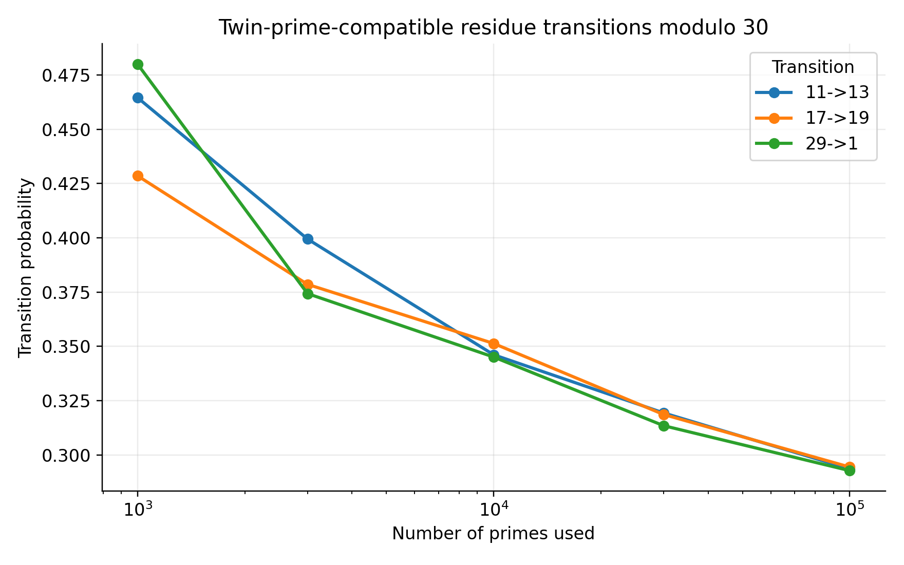
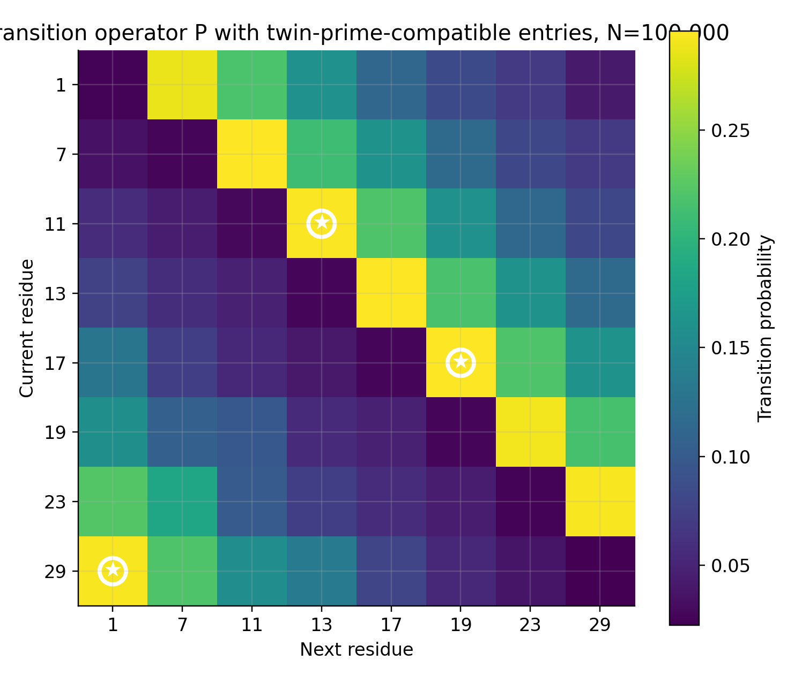

# Bridge — Residue Transitions and the Twin Prime Conjecture

This note connects the residue-transition framework of this repository with the twin prime conjecture through explicit residue transitions and measurable operators.

---

## Twin primes

A twin prime pair is:

\[
p,\; p+2
\]

with both values prime.

The twin prime conjecture states that infinitely many such pairs exist.

---

## Residue perspective modulo 30

For primes greater than \(5\),

\[
p \bmod 30 \in \{1,7,11,13,17,19,23,29\}.
\]

A twin prime pair corresponds to a residue transition

\[
r \to r+2 \pmod{30}.
\]

Among these residue classes, the twin-prime-compatible transitions are:

\[
11 \to 13,\quad 17 \to 19,\quad 29 \to 1.
\]

These are the only transitions modulo \(30\) corresponding to gap \(+2\) that avoid divisibility by \(2,3,5\).

---

## Transition operator

In the transition operator \(P\),

\[
P_{ij} = \Pr(x_{n+1}=j \mid x_n=i),
\]

the twin-prime-compatible transitions correspond to:

\[
P_{11,13},\quad P_{17,19},\quad P_{29,1}.
\]

These entries directly measure how often consecutive primes realize twin-prime-compatible transitions.

---

## Residual operator

Define:

\[
\Delta = P^{(2)} - P^2.
\]

This compares observed two-step structure with the first-order baseline.

\(\Delta\) isolates structure not accounted for by \(P\).

---

## Operational view

Twin-prime-compatible transitions can be tracked at two levels:

- **First-order:** entries of \(P\)  
- **Second-order:** structure reflected in \(\Delta\)  

This provides a direct way to measure how twin-prime-compatible transitions behave within the prime sequence.

---

## Experiment

The notebook:

```
../scripts/twin_prime_transition_experiment.ipynb
```

tracks:

```
11 → 13
17 → 19
29 → 1
```

across increasing prime sample sizes.

---

### Transition entries



This figure shows how the probabilities of twin-prime-compatible transitions evolve as more primes are included.

---

### Transition operator (highlighted)



This heatmap shows the transition operator \(P\), with twin-prime-compatible entries highlighted.

---

## Interpretation

This framework does not address the asymptotic question of the twin prime conjecture.

It provides:

- a representation of twin-prime-compatible transitions  
- a direct measurement of their frequency  
- a way to track their behavior across sample sizes  
- a comparison point for control models  

---

## Summary

Twin primes correspond to specific residue transitions modulo \(30\).

Within this framework:

- they appear as entries in \(P\)  
- their behavior can be tracked directly  
- their structure can be compared with baseline models  

This provides a computational perspective on twin-prime behavior through explicit transition operators.
