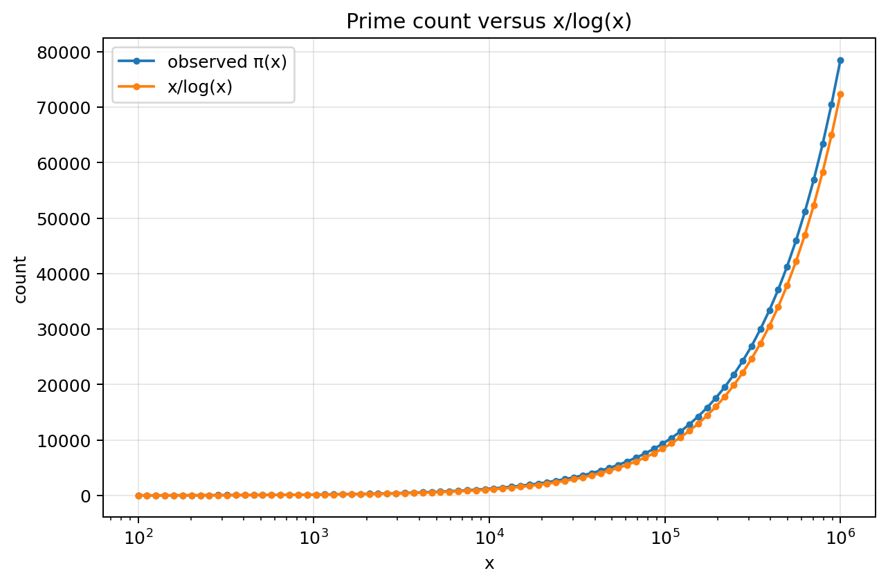
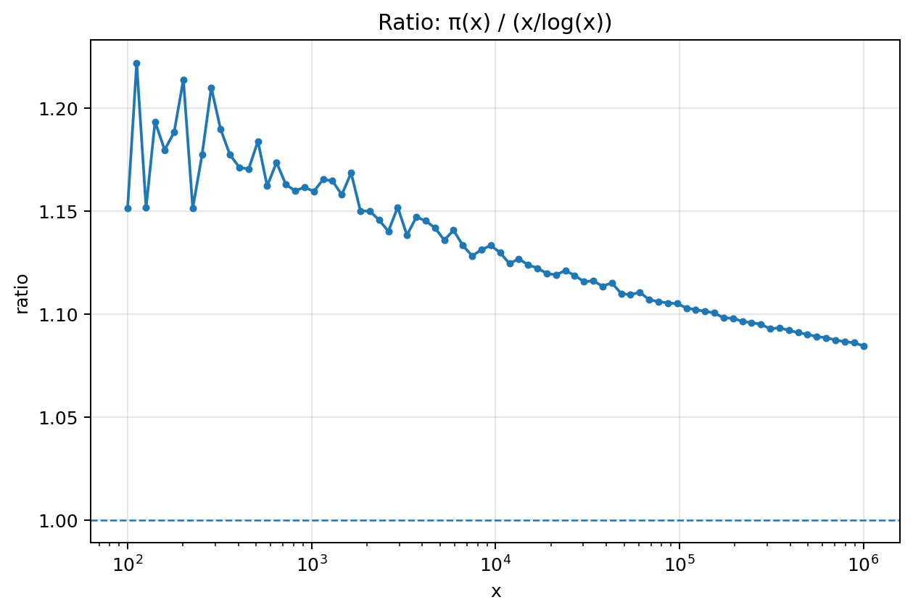
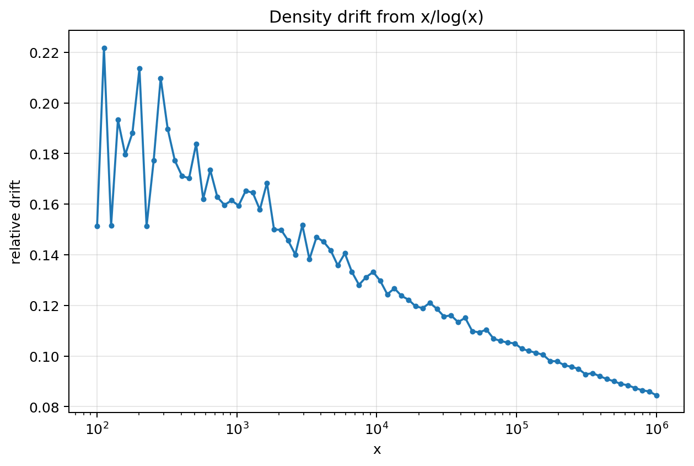

# Prime Density vs x/log(x)

## Constraint result

This notebook measured prime density by comparing observed prime counts to the logarithmic baseline:

pi(x) approximately x/log(x).

For primes up to 1,000,000, the final sampled ratio was:

- final pi(x)/(x/log(x)) = 1.084490
- final density drift = 0.084490

## Continues

Prime counts continue increasing across scale. The sequence is locally irregular but globally countable.

## Remains under constraint

The observed count pi(x) remains close to the logarithmic density baseline x/log(x) at large scales.

## Drift

Density drift was measured as |pi(x) - x/log(x)| / (x/log(x)).

- mean density drift = 0.133313
- median density drift = 0.128925
- max density drift = 0.221754

## CGCS score

CGCS_density = 1 / (1 + mean density drift).

- CGCS_density = 0.882369

## Recoverability

The baseline x/log(x) recovers the global count scale of primes, not exact prime locations.

## Caution

This notebook does not prove the Prime Number Theorem or RH. It provides a reproducible measurement of global density structure and drift.

## Figures

### Figure 1 — Prime count versus x/log(x)

### Figure 2 — Ratio to logarithmic baseline

### Figure 3 — Density drift from x/log(x)

