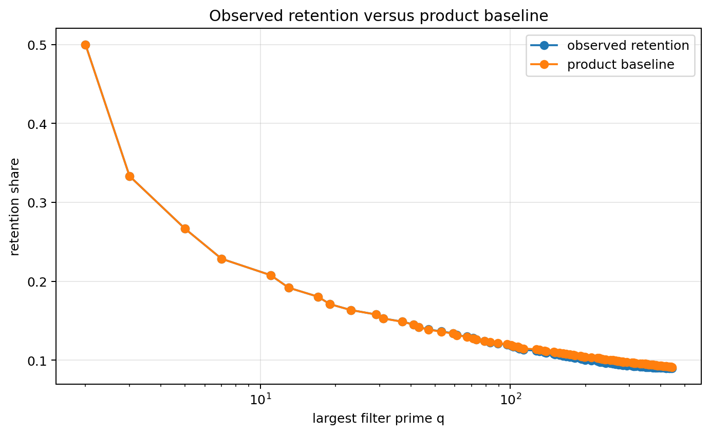
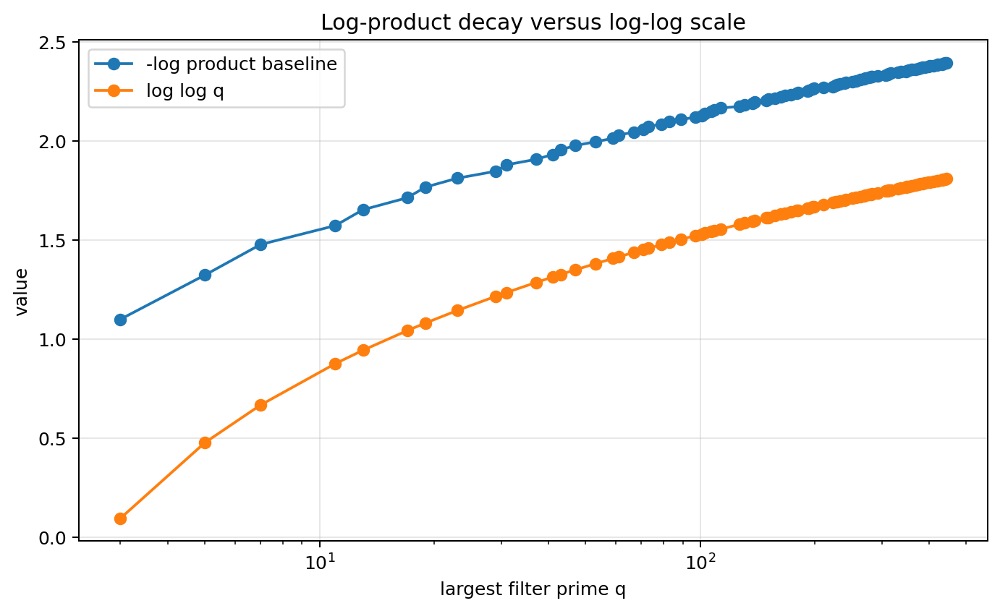
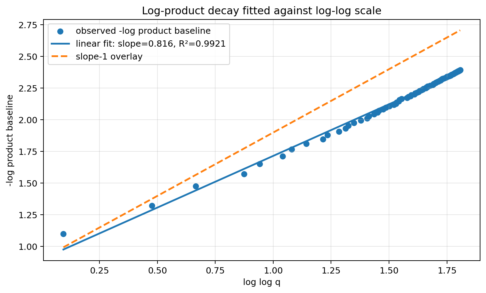
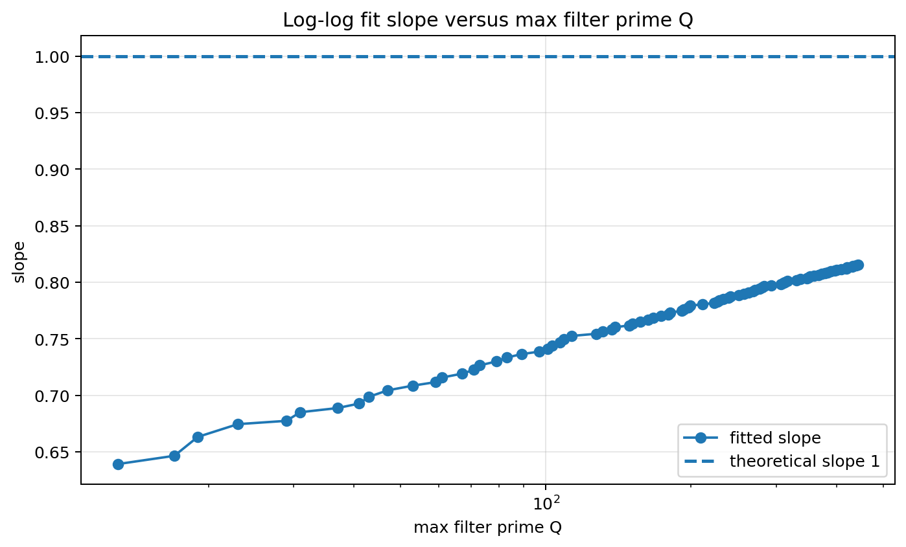
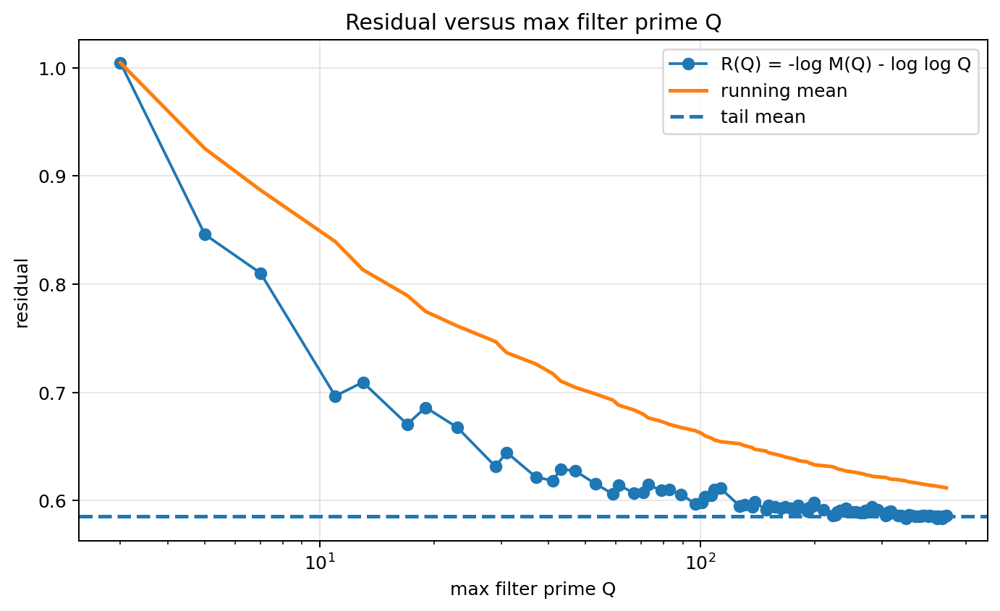
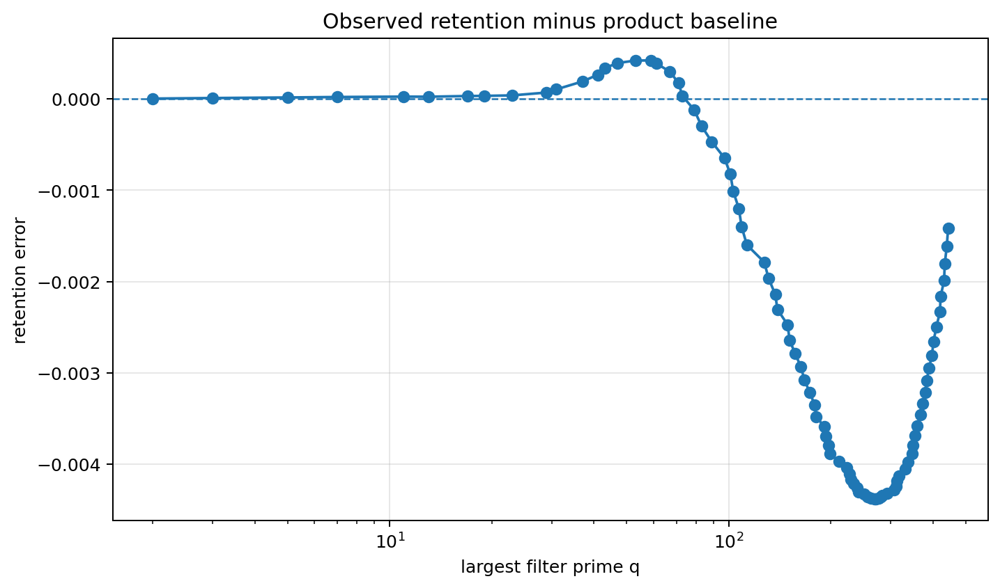

# Sieve Constraints

## Constraint result

This notebook measured sieve filtering as layered divisibility constraints.

The candidate universe started with 199,999 integers from 2 to 200,000.
After applying all prime filters q <= sqrt(N), the final retained count was 17,984.

## Remains under constraint

Values that remain after all divisibility filters match the reference prime set.

## Drift

Composite multiples drift out layer by layer. Early filters remove the largest number of candidates.

Drift accumulates monotonically as composite structure is removed, while retention converges toward the prime density scale.

## Product baseline and error tracking

The cumulative product baseline compares observed retention with an idealized independent-filter model:

M(Q) = product_{q <= Q}(1 - 1/q).

- final observed retention = 0.089920
- final product baseline = 0.091337
- final retention minus product baseline = -0.001416
- mean absolute product-baseline error = 0.002341
- final observed decay = 2.408830
- final log-product decay = 2.393204
- final decay error = 0.015626
- correlation between log-product decay and log log q = 0.996045
- log-log fit slope = 0.815598
- log-log fit intercept = 0.898800
- log-log fit R^2 = 0.992105
- final prefix slope from slope-vs-max-Q test = 0.815598
- final prefix slope gap to 1 = 0.184402
- final prefix R^2 = 0.992105

## Residual analysis

Residual diagnostic: R(Q) = -log M(Q) - log log Q.

- tail residual mean = 0.585803
- tail residual std = 0.001542
- tail residual range = 0.006826
- tail residual slope vs log log Q = -0.054571
- convergence-to-constant score = 0.940788

A flatter residual tail supports the interpretation that the finite product model is moving toward a constant-corrected log-log regime.

## CGCS score

CGCS_sieve = |S_final ∩ P_N| / |P_N|.

- CGCS_sieve = 1.000000
- precision = 1.000000
- recall = 1.000000
- exact match = True

## Recoverability

The full sieve recovers prime identity exactly up to N when all prime filters q <= sqrt(N) are applied.

Exact recovery holds because the sieve encodes all divisibility constraints needed to certify primality below N.

## Caution

The fitted slope remains below the asymptotic value 1 in this finite range. This indicates a pre-asymptotic constraint-accumulation regime, not a failure of the product model.

The deviation reflects incomplete accumulation of prime constraints and residual correlations between divisibility conditions.

The product model provides a first-order density approximation, but finite sieve behavior includes correlation effects not captured by independence.

This notebook demonstrates finite exact recovery by the classical sieve. It does not claim a new primality theorem.

## Figures

### Figure 1 — Retained candidates by sieve layer

### Figure 2 — Removed candidates by prime filter

### Figure 3 — Retention and drift by layer

### Figure 4 — Observed retention versus product baseline

### Figure 5 — Log-product decay versus log-log scale

### Figure 6 — Fitted log-log overlay

### Figure 7 — Slope versus max Q

### Figure 8 — Residual versus max Q

### Figure 9 — Product-baseline error

