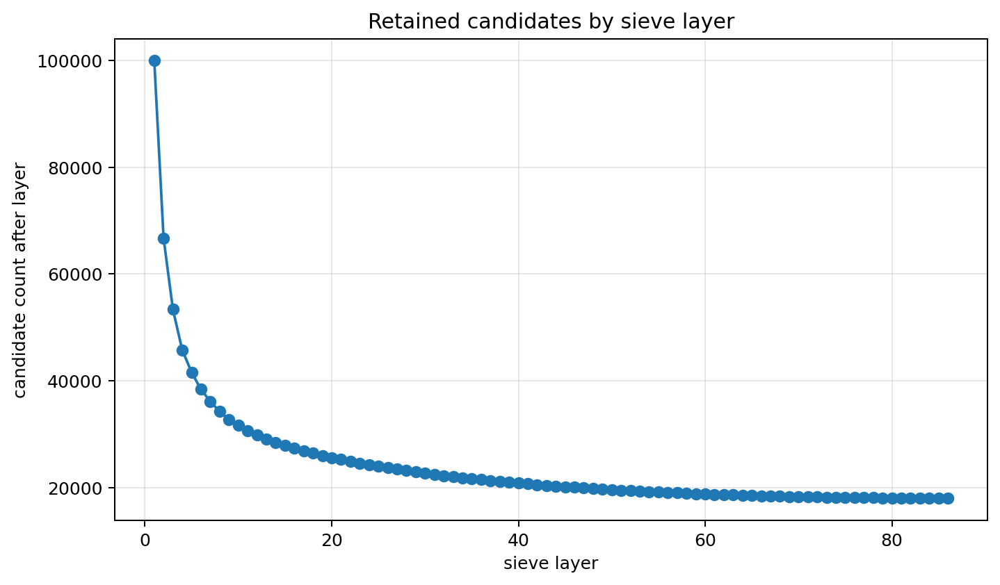
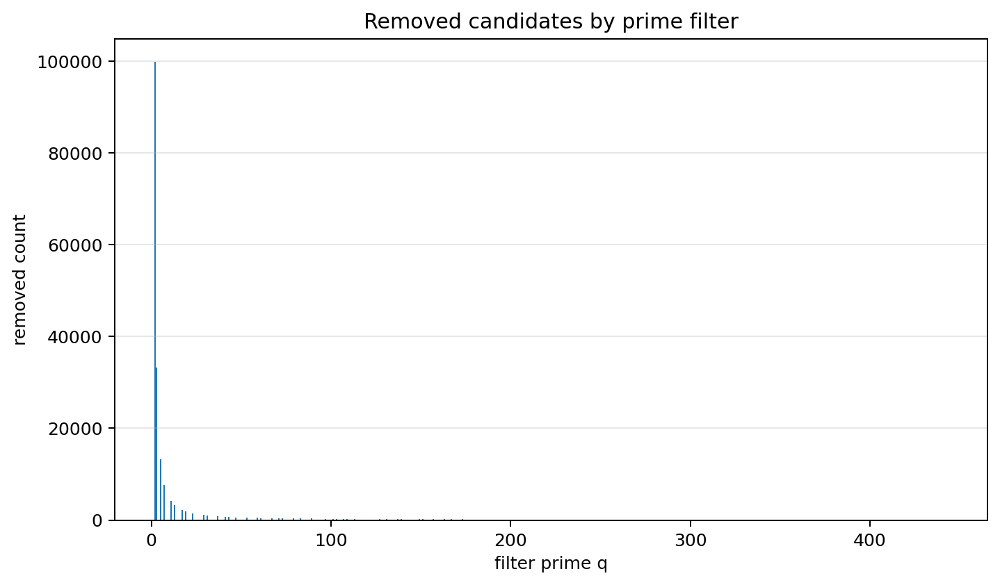
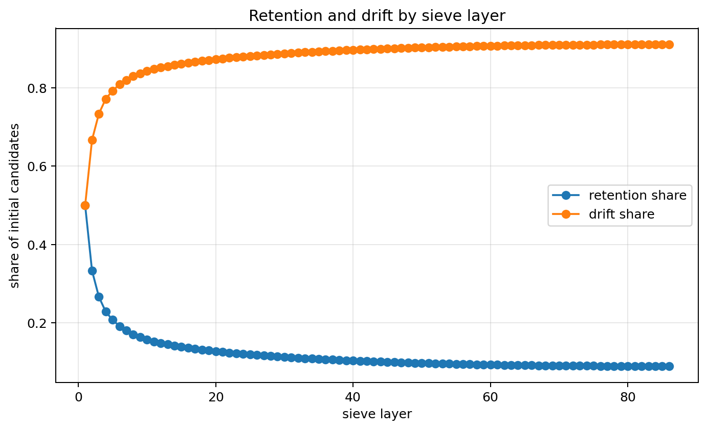

# Sieve Constraints

## Constraint result

This notebook measured sieve filtering as layered divisibility constraints.

The candidate universe started with 199,999 integers from 2 to 200,000.
After applying all prime filters q <= sqrt(N), the final retained count was 17,984.

## Remains under constraint

Values that remain after all divisibility filters match the reference prime set.

## Drift

Composite multiples drift out layer by layer. Early filters remove the largest number of candidates.

## CGCS score

CGCS_sieve = |S_final ∩ P_N| / |P_N|.

- CGCS_sieve = 1.000000
- precision = 1.000000
- recall = 1.000000
- exact match = True

## Recoverability

The full sieve recovers prime identity exactly up to N when all prime filters q <= sqrt(N) are applied.

## Caution

This notebook demonstrates finite exact recovery by the classical sieve. It does not claim a new primality theorem.

## Figures

### Figure 1 — Retained candidates by sieve layer

### Figure 2 — Removed candidates by prime filter

### Figure 3 — Retention and drift by layer

