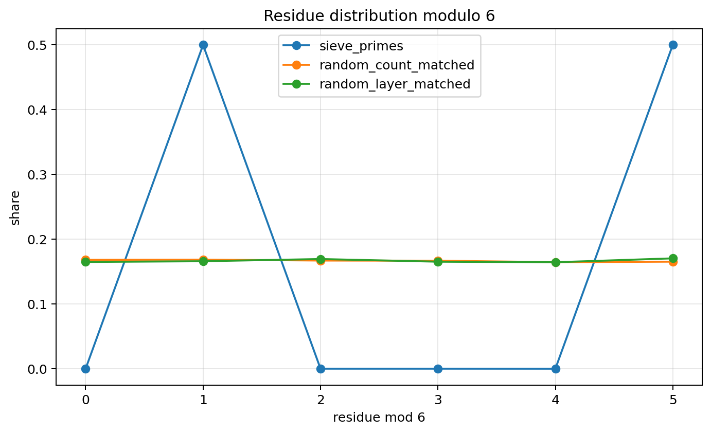
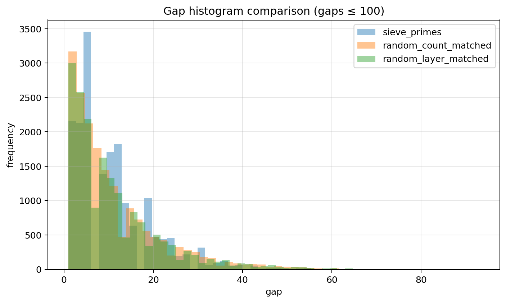
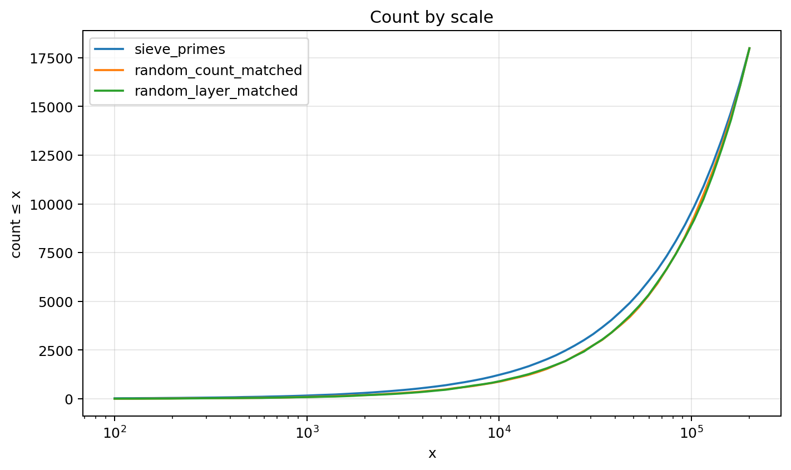
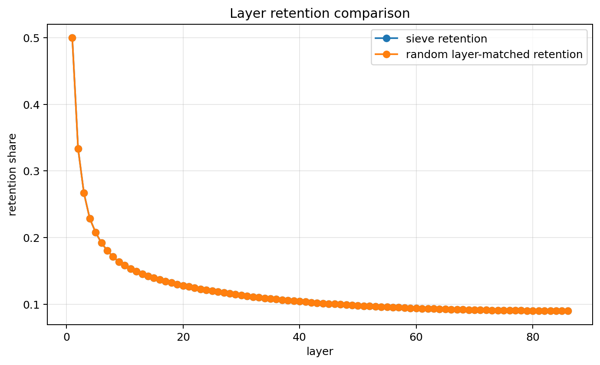
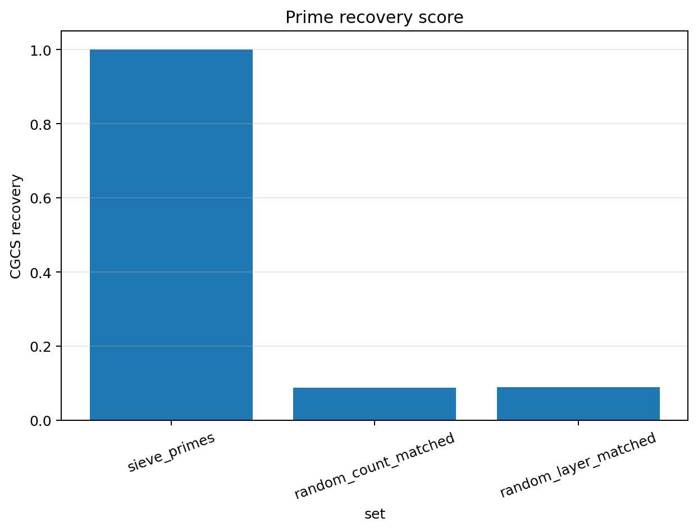

# Random vs Sieve

## Constraint result

This notebook compared deterministic sieve filtering against random removal controls.

The key test is whether matched count or matched retention reproduces prime structure.

## Sets compared

1. sieve_primes: the reference prime set recovered by deterministic sieve filtering.
2. random_count_matched: a random set with the same final count as the prime set.
3. random_layer_matched: a random-control process that removes the same number of candidates at each sieve layer.

## Recovery scores

- sieve recovery = 1.000000
- random-count-matched recovery = 0.088634
- random-layer-matched recovery = 0.089858

## Core result

Same count does not imply same structure.

Random removal can imitate density or retention count, but it does not recover prime residue structure, gap structure, or prime identity.

## Remains under constraint

The sieve-retained set remains under divisibility constraints and recovers primes exactly.

## Drift

Random controls drift away from prime structure despite matched final count or matched layer removals.

## Recoverability

Sieve filtering recovers prime identity exactly. Random controls do not.

## Caution

Random controls are comparison baselines. They do not represent a theory of prime generation.

## Figures

### Figure 1 — Residue comparison modulo 6

### Figure 2 — Gap histogram comparison

### Figure 3 — Density by scale

### Figure 4 — Layer retention comparison

### Figure 5 — Recovery score comparison

