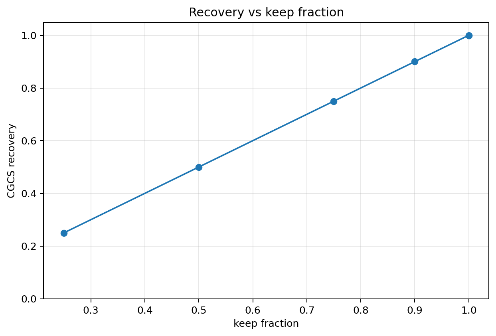
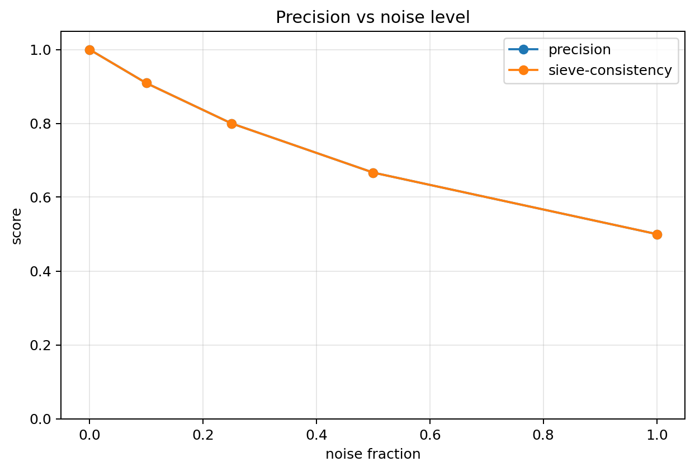
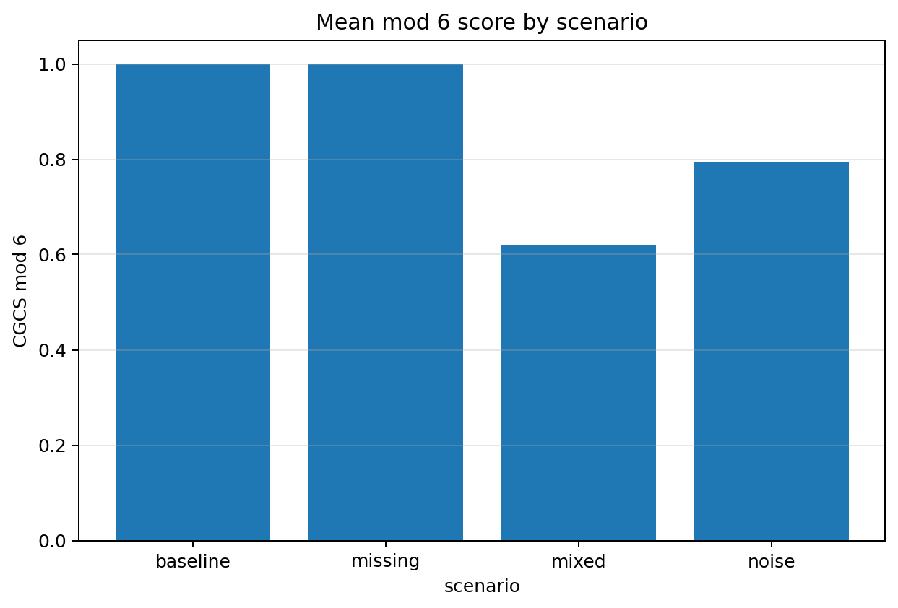
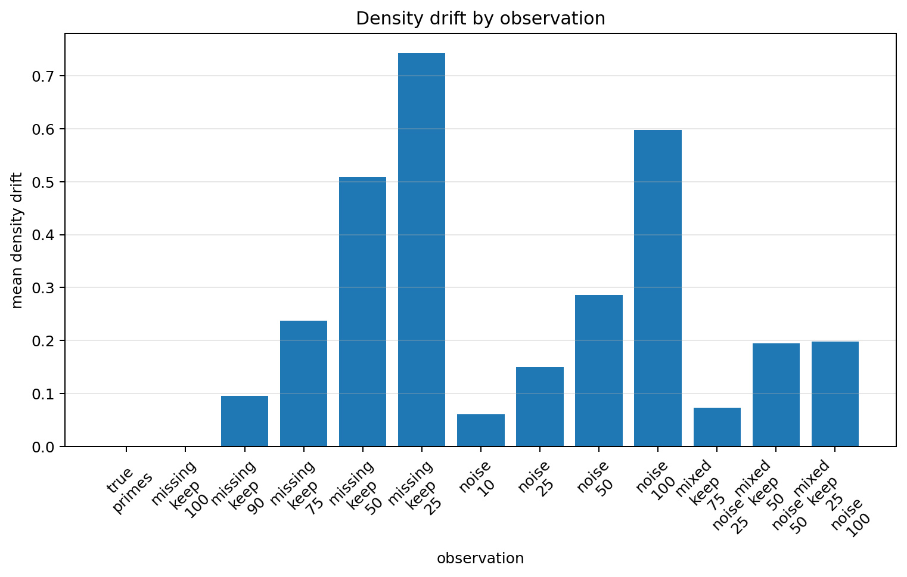
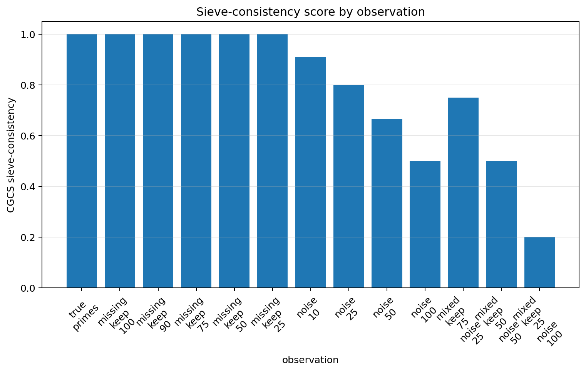
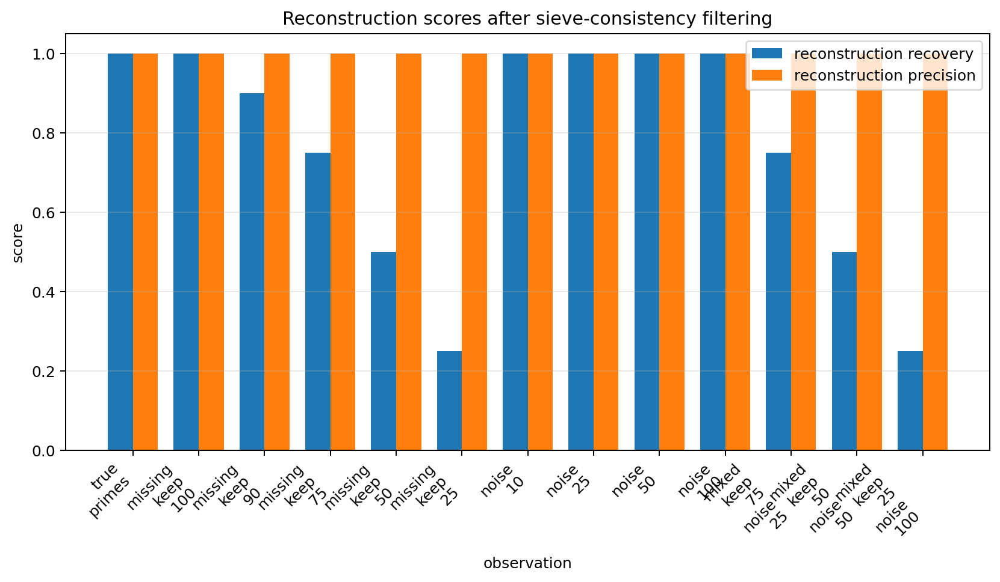

# Recoverability Under Partial Observation

## Constraint result

This notebook corrupted the prime set through missing observations, added noise, and mixed corruption.

The goal was to test which constraint signals remain recoverable under partial observation.

## Main findings

Partial observation weakens count recovery but does not erase constraint signal.

Missing-prime observations preserve precision and mod 6 structure while reducing recovery.

Noisy observations preserve recovery when all primes remain present, but precision and sieve-consistency decline.

Mixed corruption weakens both recovery and precision.

## Recovery and precision

- baseline recovery = 1.000000
- baseline precision = 1.000000
- worst mixed recovery = 0.250000
- worst mixed precision = 0.200000

## Mod 6 and sieve-consistency

The mod 6 score remains high for missing-prime observations because removing primes does not add invalid residues.

Added composite noise lowers precision and sieve-consistency.

## Reconstruction

Sieve-consistency filtering removes composite noise and restores precision among retained observations.

It cannot restore missing primes, so reconstruction recovery remains limited by the keep fraction.

## Core result

Constraint structure remains detectable after corruption.

## Caution

This notebook studies finite recoverability diagnostics. It does not prove a new theorem about primes.

## Figures

### Figure 1 — Recovery vs keep fraction

### Figure 2 — Precision vs noise level

### Figure 3 — Mod 6 score by scenario

### Figure 4 — Density drift by observation

### Figure 5 — Sieve-consistency scores

### Figure 6 — Reconstruction scores

