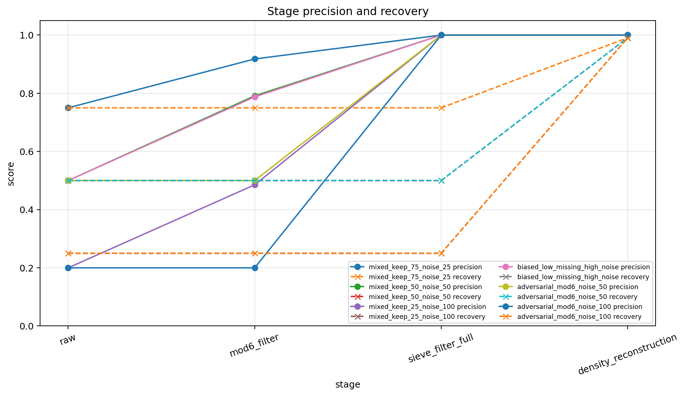
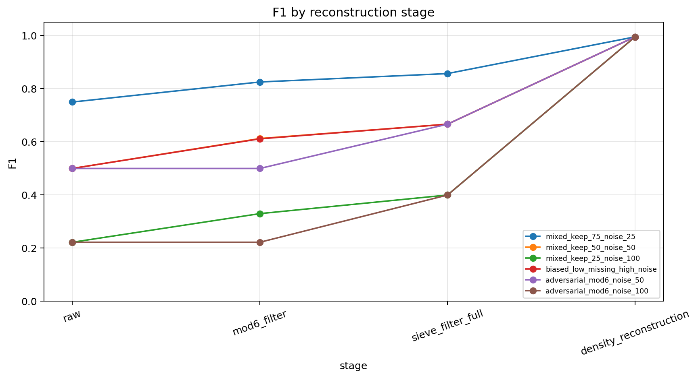
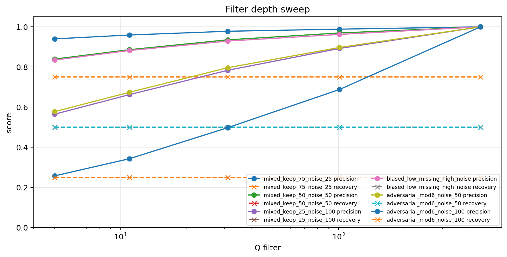
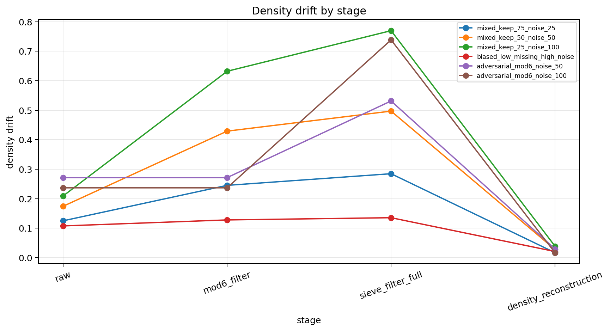
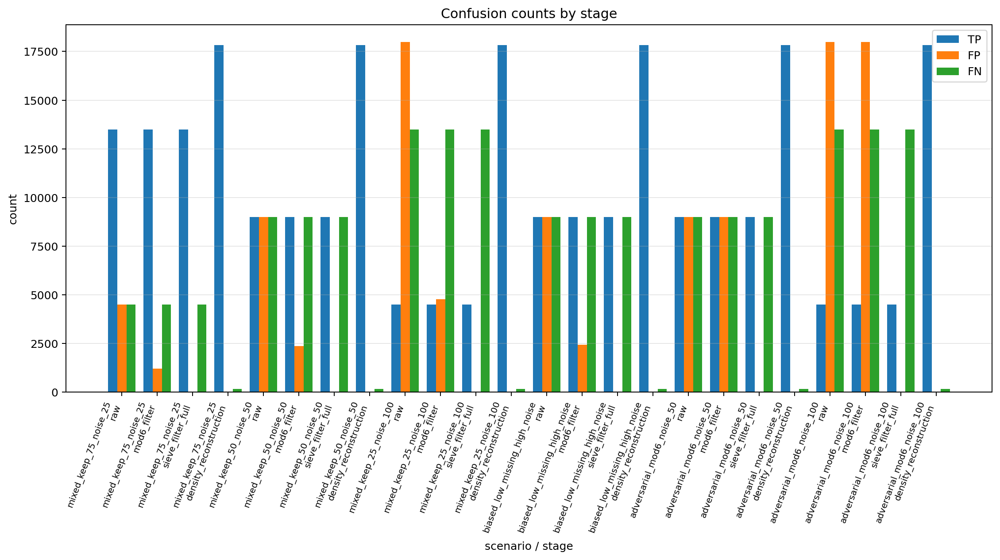
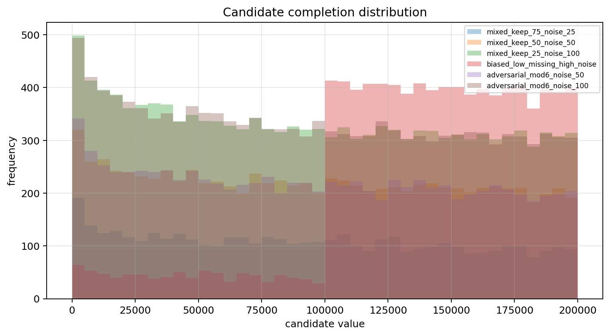
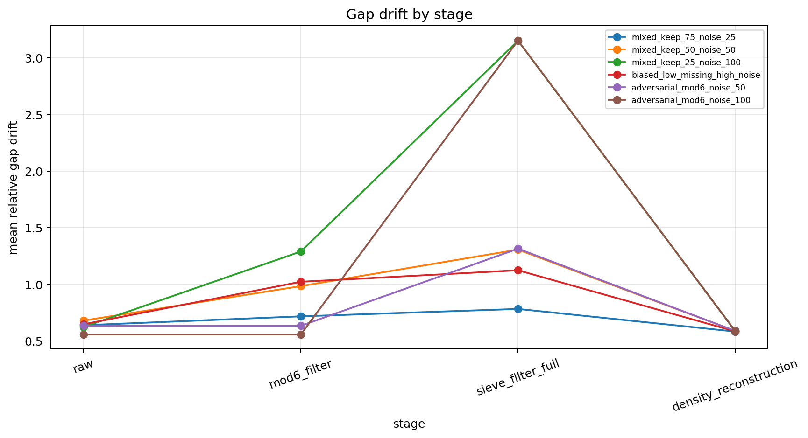
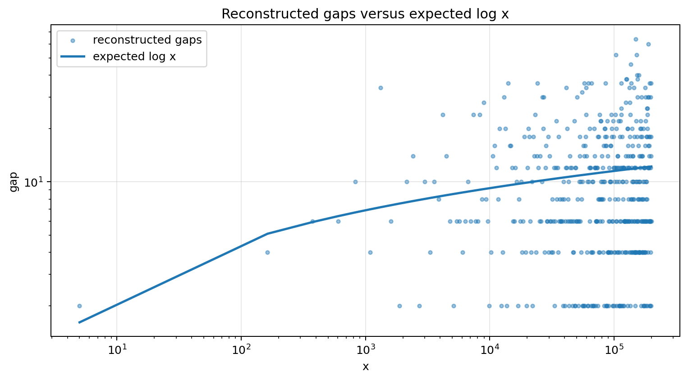

# Constraint Reconstruction

## Constraint result

This notebook tested staged reconstruction from corrupted prime observations, including adversarial stress tests.

The stages were raw observation, residue filtering, sieve filtering, and density-guided reconstruction.

## Main findings

Filtering restores precision.

Reconstruction trades precision for recovery.

Density-guided completions are candidate hypotheses, not certified primes.

v2 stress tests show that global density can repair count-scale drift while still requiring local gap validation.

## Stress tests

Biased range corruption removes information unevenly across scale.

Adversarial mod-6 noise passes the easiest residue screen, forcing sieve-depth and gap diagnostics to do more work.

## Stage behavior

Raw observations contain both missing primes and composite noise.

Residue filtering removes easy invalid residues while preserving most primes.

Sieve filtering removes composite noise and raises precision strongly.

Density-guided reconstruction adds candidates to reduce missing-count drift, improving recovery at the cost of possible false positives.

Gap diagnostics test whether reconstructed candidates match local spacing structure rather than only global density.

## Summary metrics

- mean raw precision = 0.441667
- mean sieve-filter precision = 1.000000
- mean reconstruction recovery = 0.990881
- mean reconstruction precision = 1.000000
- mean reconstruction F1 = 0.995420
- mean reconstruction gap drift = 0.587789
- candidate completion count = 57470

## Core result

Sieve constraints clean noise; density constraints propose missing candidates; gap diagnostics test structural realism.

## Caution

Candidate completions are not proofs of primality. They are constraint-consistent hypotheses for missing structure.

## Figures

### Figure 1 — Stage precision and recovery

### Figure 2 — F1 by stage

### Figure 3 — Filter depth sweep

### Figure 4 — Density drift by stage

### Figure 5 — Confusion counts

### Figure 6 — Candidate completion distribution

### Figure 7 — Gap drift by stage

### Figure 8 — Reconstructed gap versus expected log x

