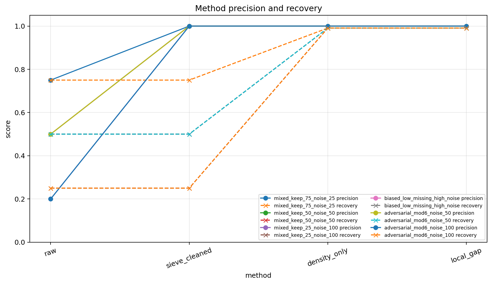
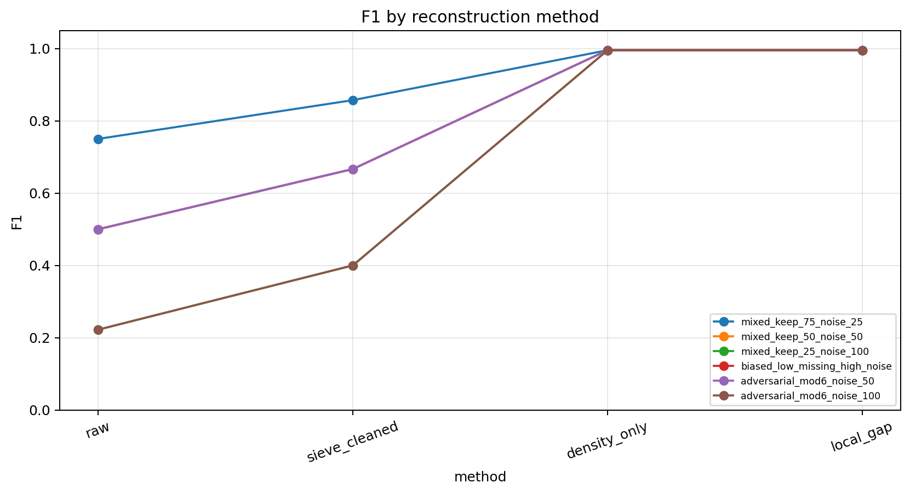
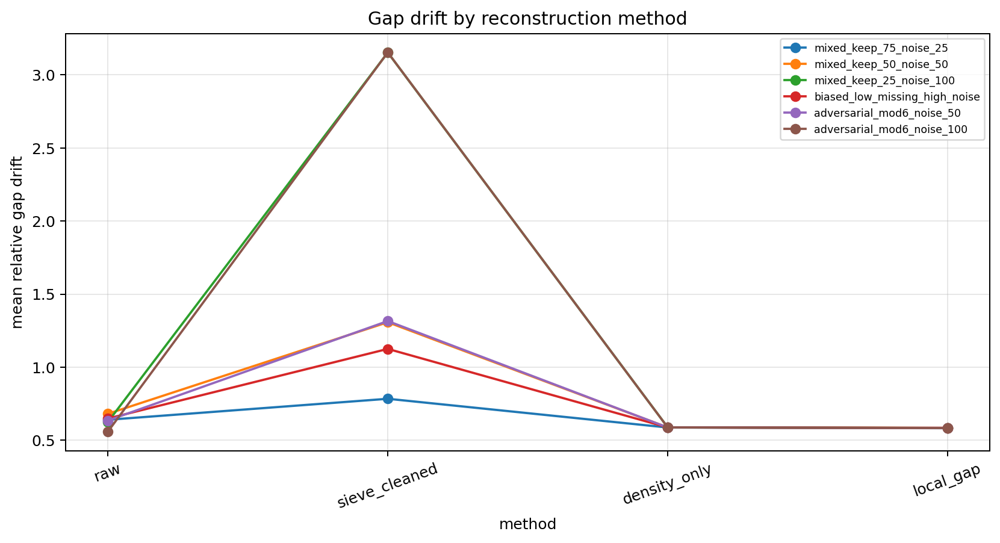
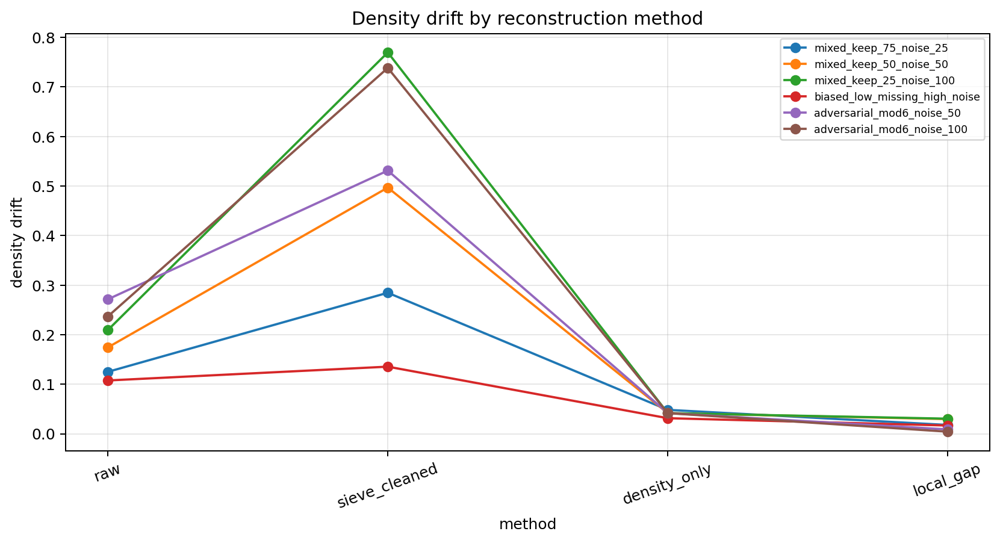
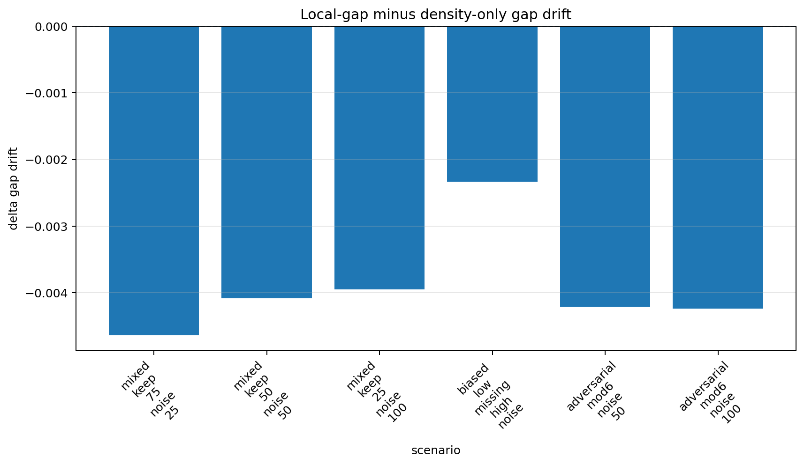
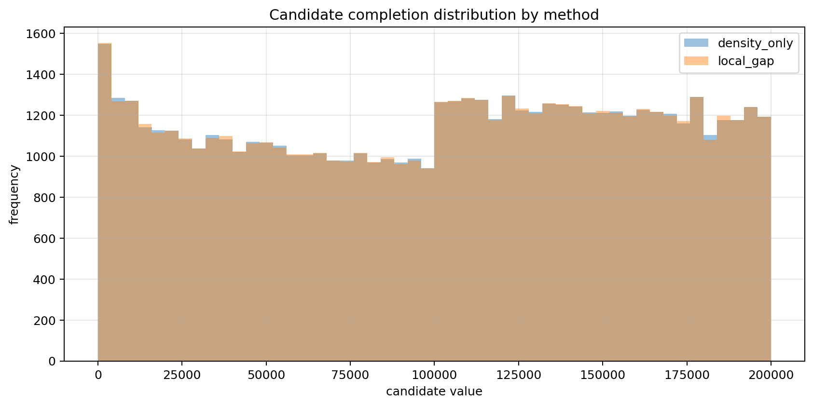
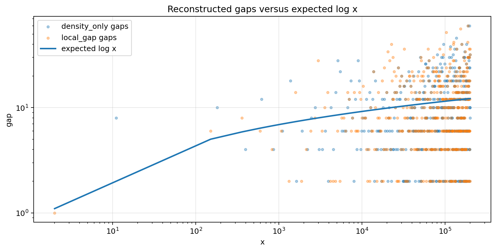
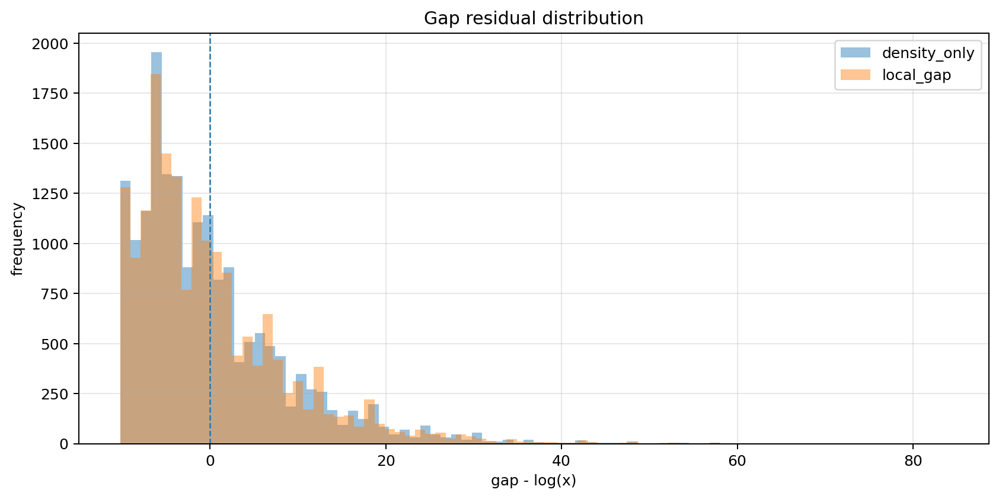

# Local Gap Reconstruction

## Constraint result

This notebook compares density-only reconstruction against local-gap reconstruction.

Notebook 07 showed that density reconstruction can repair global count while still leaving local spacing artifacts.

Notebook 08 adds local gap scoring to test whether reconstructed candidates match expected spacing.

## Main findings

Density-only reconstruction restores missing mass and improves recovery.

Local-gap reconstruction preserves the global reconstruction objective while adding a local spacing test.

F1 alone is not sufficient because a reconstruction can score well on identity/count metrics while retaining unrealistic gap structure.

## Summary metrics

- mean density-only F1 = 0.995448
- mean local-gap F1 = 0.995420
- mean density-only gap drift = 0.587539
- mean local-gap gap drift = 0.583631
- mean gap-drift delta local-minus-density = -0.003908
- candidate completion count = 114940

## Interpretation

Sieve filtering restores precision by removing composite noise.

Density reconstruction restores global missing mass.

Local-gap reconstruction tests whether added candidates are placed in structurally plausible gaps.

## Caution

Local gap scoring improves structural diagnostics, but candidate completions remain hypotheses rather than certified primes.

## Core statement

Density restores missing mass; local gap scoring tests whether reconstructed mass lands in structurally plausible places.

## Figures

### Figure 1 — Method precision and recovery

### Figure 2 — F1 by method

### Figure 3 — Gap drift by method

### Figure 4 — Density drift by method

### Figure 5 — Gap drift delta

### Figure 6 — Candidate completion distribution

### Figure 7 — Reconstructed gaps versus expected log x

### Figure 8 — Gap residual distribution

