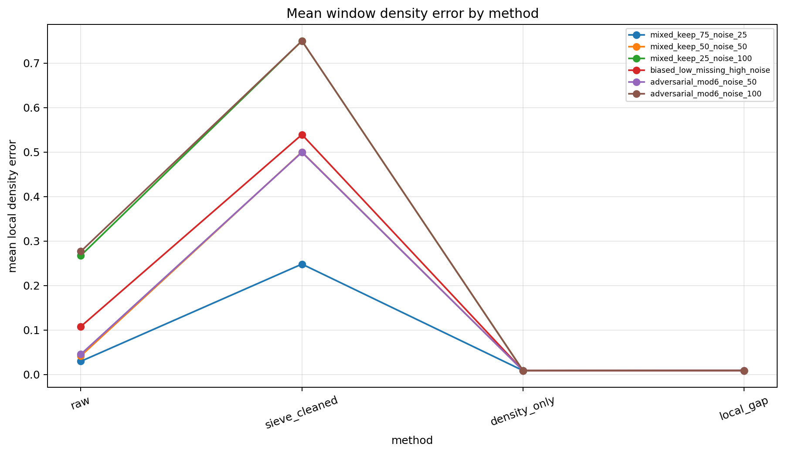
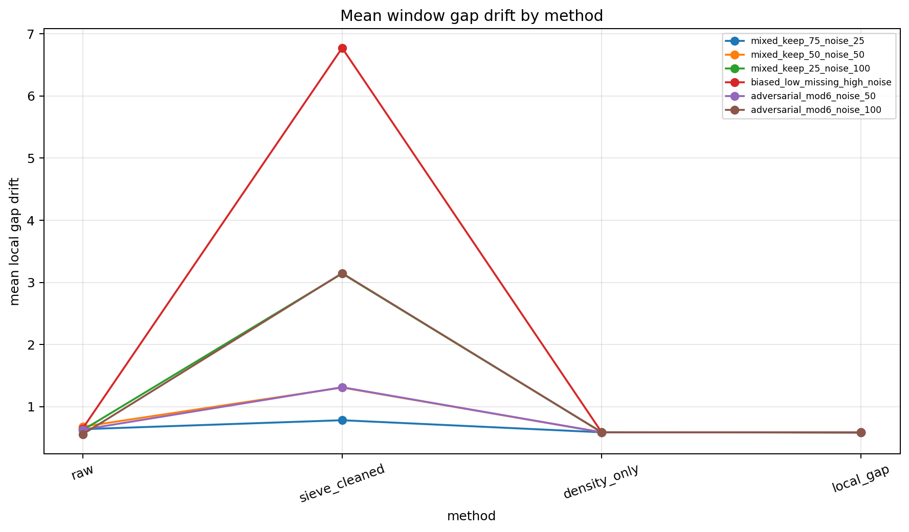
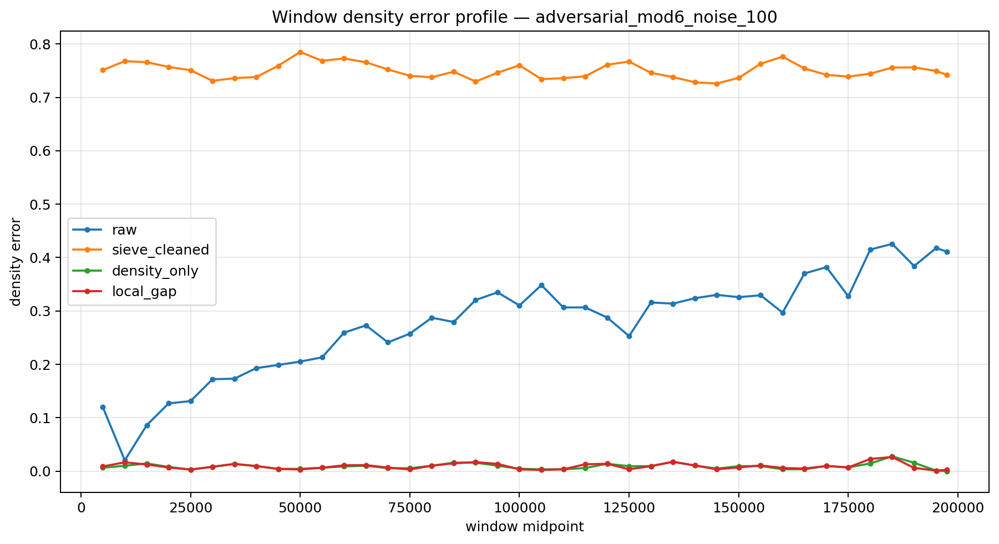
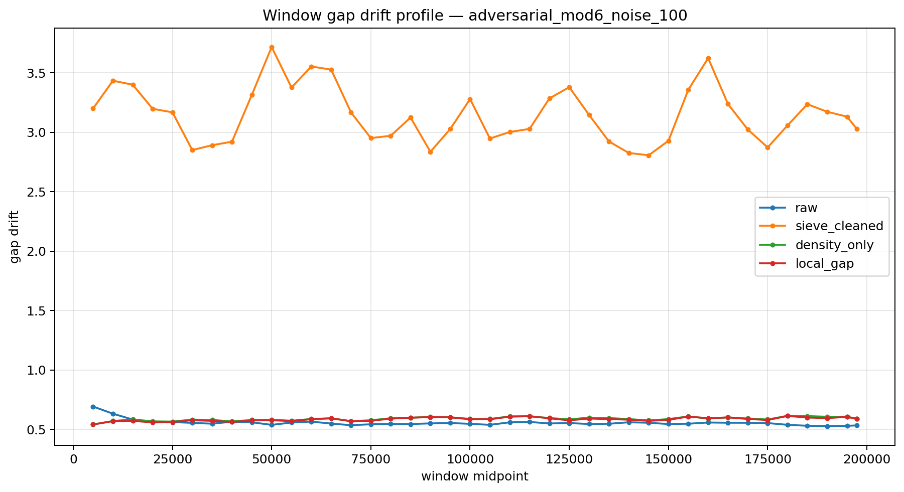
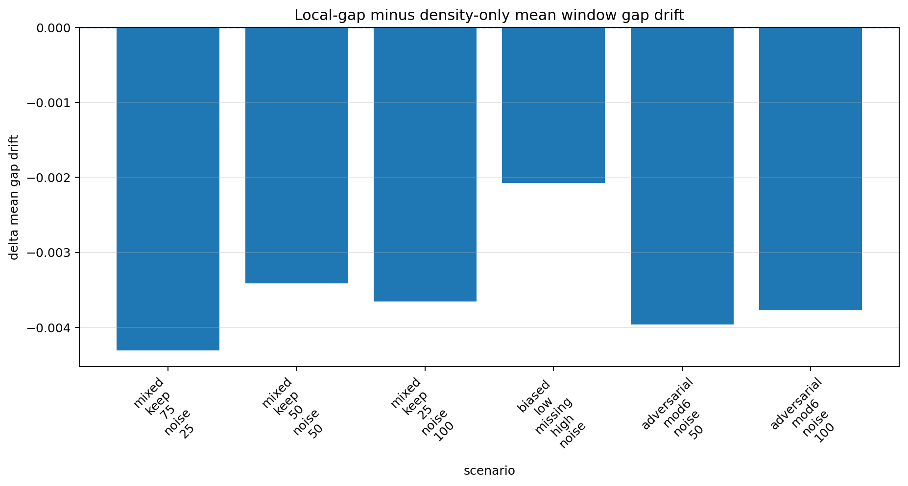
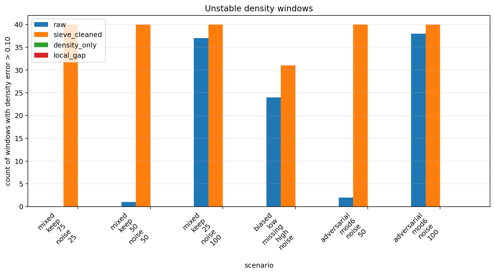
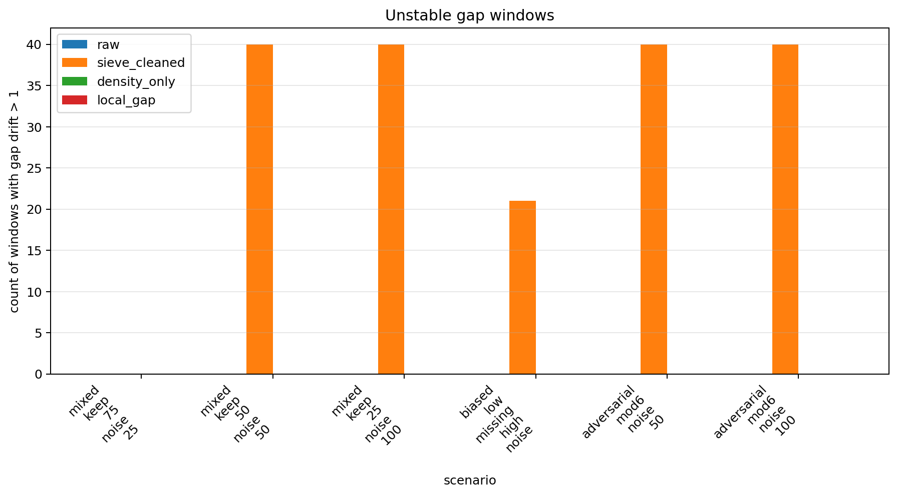
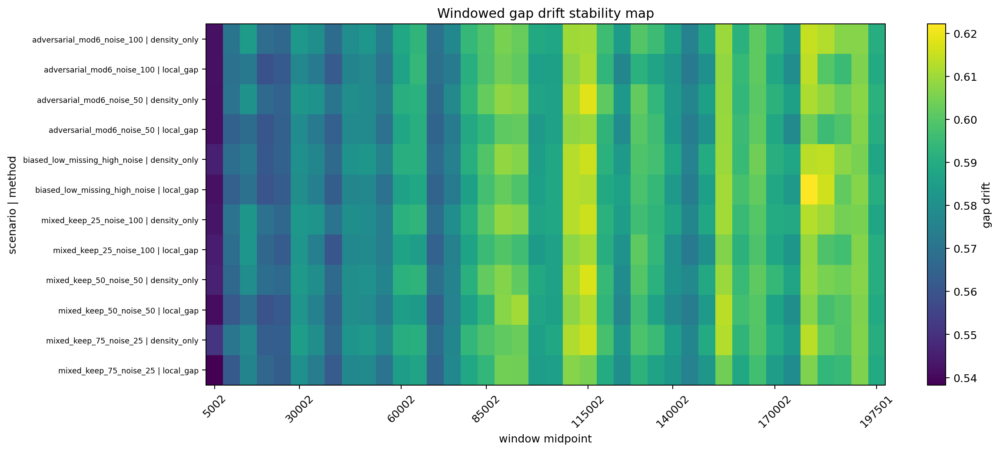

# Windowed Reconstruction Stability

## Constraint result

This notebook evaluates reconstruction stability in sliding windows.

Notebook 07 and 08 showed that global F1 and global density can saturate.

Notebook 09 tests local density error and local gap drift across windows.

## Main findings

Global reconstruction metrics are not sufficient.

Windowed diagnostics expose local instability that global metrics can hide.

Density-only and local-gap reconstructions should be compared by local density error, local gap drift, and unstable-window counts.

## Summary metrics

- mean window density error, density-only = 0.008987
- mean window density error, local-gap = 0.009108
- mean window gap drift, density-only = 0.588846
- mean window gap drift, local-gap = 0.585316
- mean delta gap drift local-minus-density = -0.003530
- mean delta density error local-minus-density = 0.000121
- CGCS windowed stability score = 0.627186

## Interpretation

Sieve filtering removes invalid composites but can create local holes.

Density reconstruction repairs global mass but can still hide local failures.

Local-gap reconstruction should be judged by whether it reduces windowed gap drift and unstable windows.

## Core statement

Global reconstruction can look successful while local windows expose density, gap, and stability failures.

## Caution

Candidate completions remain hypotheses rather than certified primes.

## Figures

### Figure 1 — Mean window density error by method

### Figure 2 — Mean window gap drift by method

### Figure 3 — Window density error profile

### Figure 4 — Window gap drift profile

### Figure 5 — Window gap drift delta

### Figure 6 — Unstable density windows

### Figure 7 — Unstable gap windows

### Figure 8 — Windowed gap drift stability map

