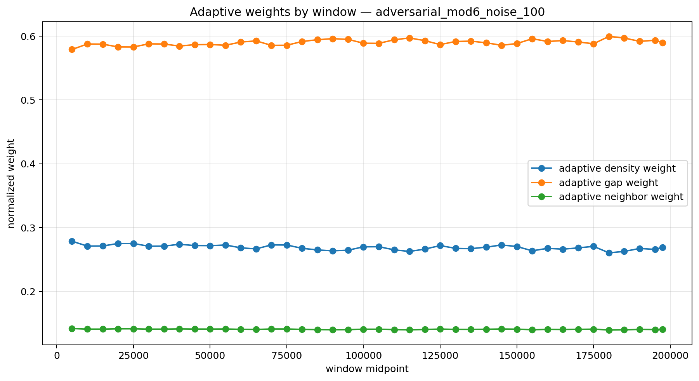
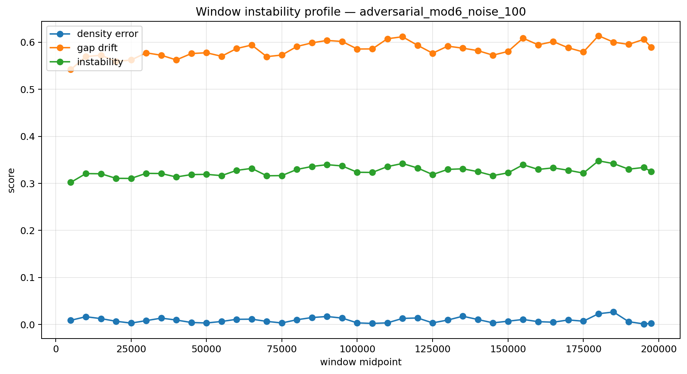
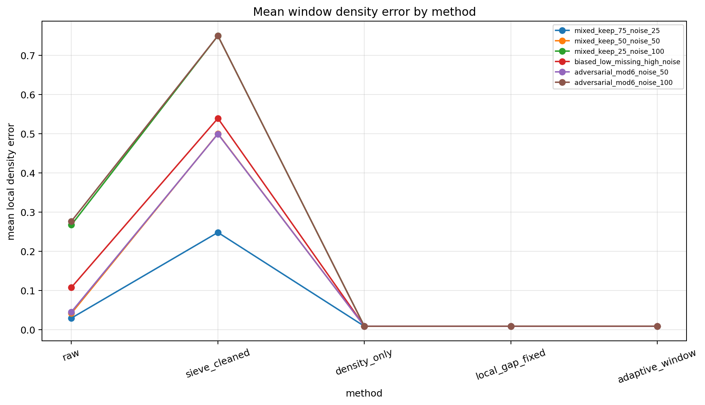
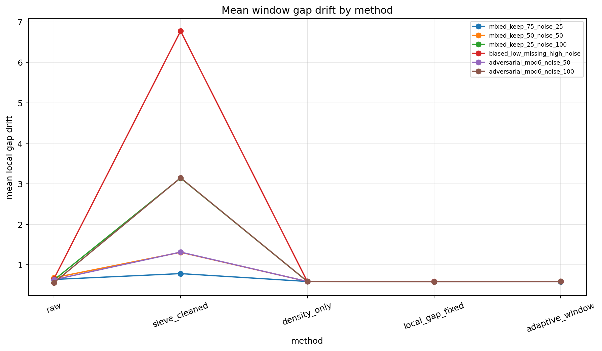
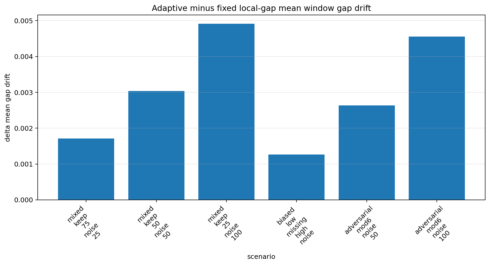
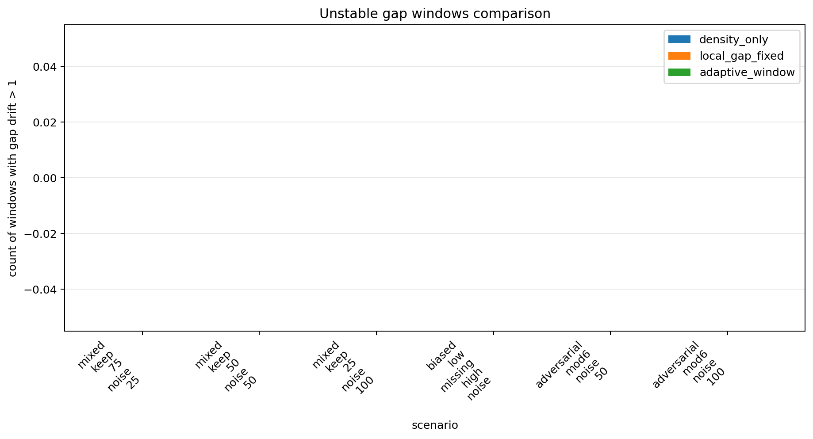
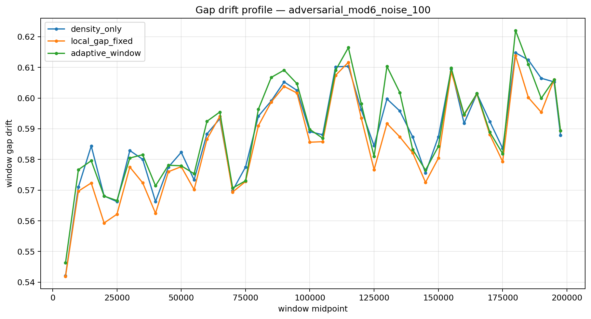
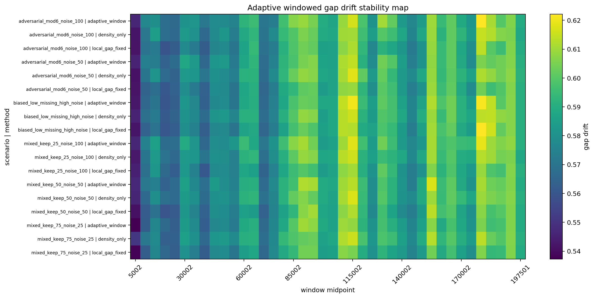
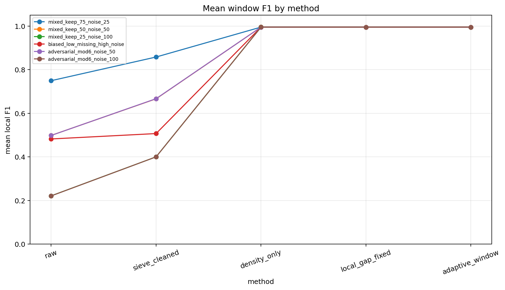

# Adaptive Window Reconstruction

## Constraint result

This notebook tests adaptive window reconstruction.

Notebook 09 showed that local-window diagnostics expose failures hidden by global metrics.

Notebook 10 uses local instability as feedback for candidate scoring.

## Adaptive rule

For a window W:

```text
instability(W) = alpha * density_error(W) + beta * gap_drift(W)
w_gap(W) = w_gap * (1 + lambda * instability(W))
w_density(W) = w_density / (1 + lambda * instability(W))
```

## Summary metrics

- mean density error, density-only = 0.008987
- mean density error, fixed local-gap = 0.009108
- mean density error, adaptive window = 0.009111
- mean gap drift, density-only = 0.588837
- mean gap drift, fixed local-gap = 0.585316
- mean gap drift, adaptive window = 0.588335
- adaptive minus fixed gap drift = 0.003019
- adaptive stability CGCS score = 0.625999

## Interpretation

Adaptive reconstruction uses local instability as feedback.

If adaptive reconstruction improves gap drift, local feedback adds value beyond fixed scoring.

If improvement is small, fixed density/local-gap reconstruction has saturated the log-gap model.

## Core statement

Adaptive window reconstruction treats local instability as feedback, converting reconstruction from a fixed global rule into a local correction process.

## Next limit

If adaptive feedback saturates, the next notebook should replace log(x) with a learned local expected-gap model.

## Figures

### Figure 1 — Adaptive weights by window



### Figure 2 — Window instability profile



### Figure 3 — Method density error



### Figure 4 — Method gap drift



### Figure 5 — Adaptive gap-drift delta



### Figure 6 — Unstable windows comparison



### Figure 7 — Gap profile under adaptive reconstruction



### Figure 8 — Adaptive stability map



### Figure 9 — Mean window F1 by method




