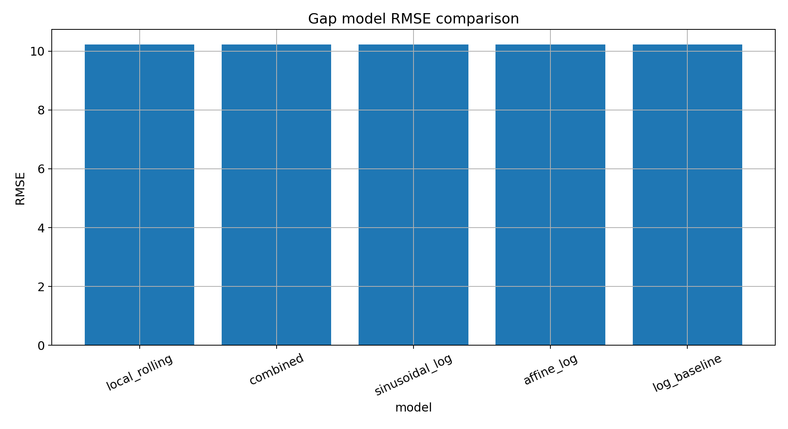
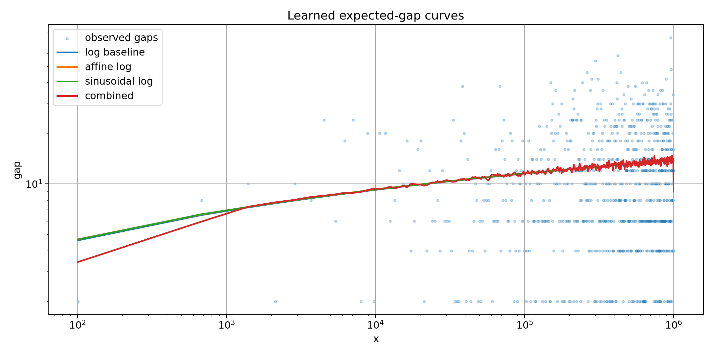
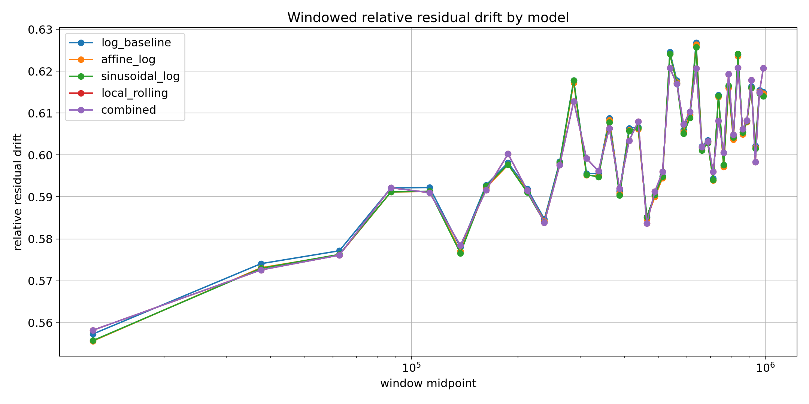
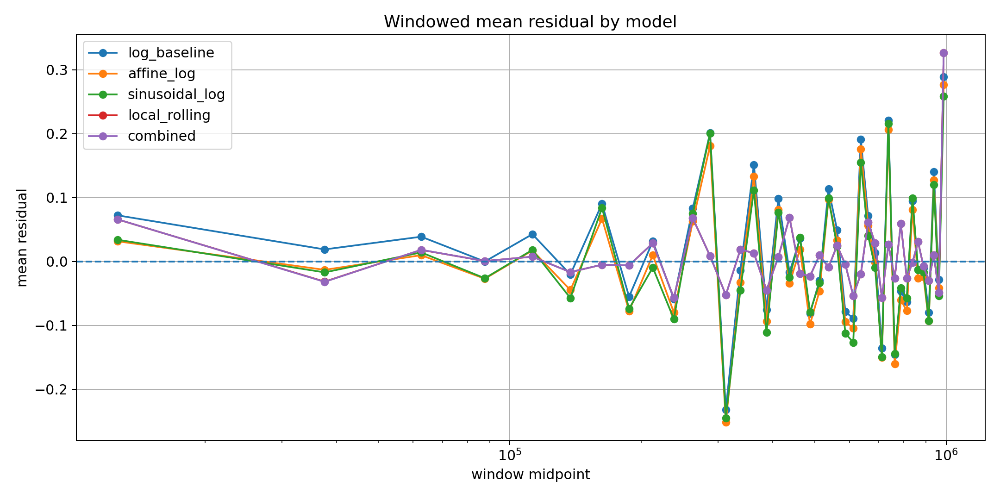
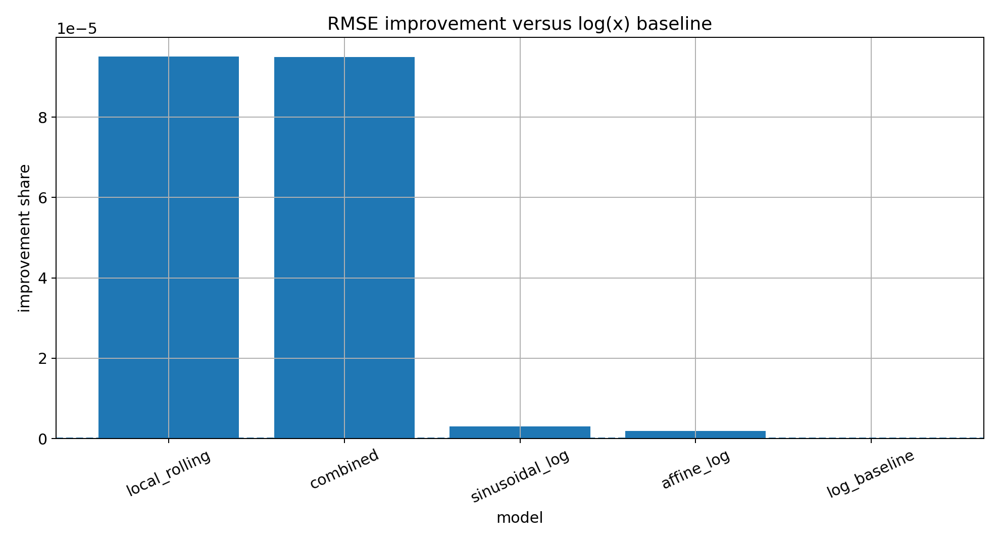

# Learned Gap Model (Notebook 11)

## Purpose

Notebook 10 showed that adaptive weighting did not materially improve reconstruction once density and local-gap constraints were saturated.

Notebook 11 tests whether the remaining limit comes from the expected-gap model itself.

Baseline model:

```text
expected gap ≈ log(x)
```

Learned alternatives:

- affine log model
- sinusoidal log-space correction
- local rolling residual correction
- combined sinusoidal + local correction

---

## 1. Model score comparison




Best model: `local_rolling`

Best RMSE: `10.224070`

Baseline log RMSE: `10.225042`

RMSE improvement vs log baseline: `0.0095%`

Interpretation:

If improvement is small, the fixed log model is already close to the available signal at this scale. If improvement is substantial, the Notebook 10 ceiling was model-limited rather than weighting-limited.

---

## 2. Expected-gap curves



This plot compares observed prime gaps to expected-gap curves.

The main question is whether learned curves track local structure better than `log(x)` without simply overfitting pointwise noise.

---

## 3. Windowed residual drift



The key diagnostic is windowed relative residual drift.

A better expected-gap model should reduce drift across windows, not only improve global RMSE.

---

## 4. Windowed mean residual



A stable model keeps mean residuals closer to zero across scale.

---

## 5. Improvement ratio



This compares each learned model against the fixed `log(x)` baseline.

---

## Core result

Notebook 11 distinguishes two possibilities:

1. **Small improvement**: reconstruction has reached a structural limit for these features.
2. **Large improvement**: expected-gap modeling was the missing piece after Notebook 10.

In either case, Notebook 11 converts the Notebook 10 observation into a sharper diagnostic:

> adaptation is not enough unless expected-gap structure improves.

---

Constraint → signal > noise
