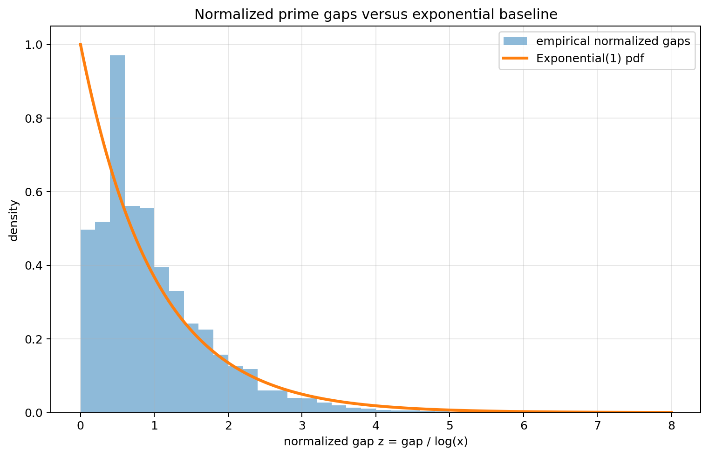
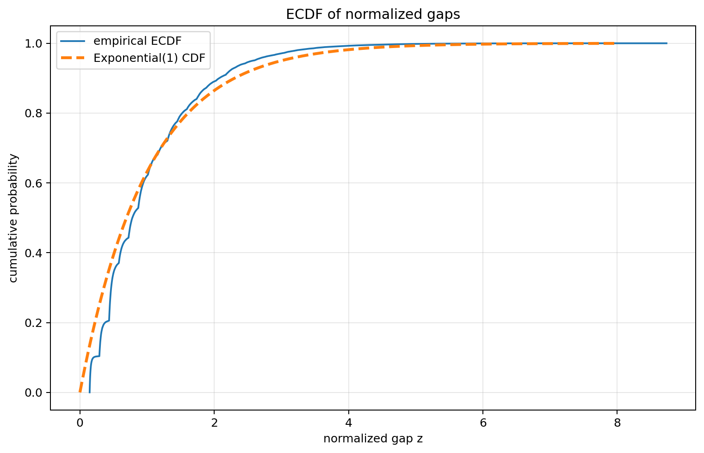
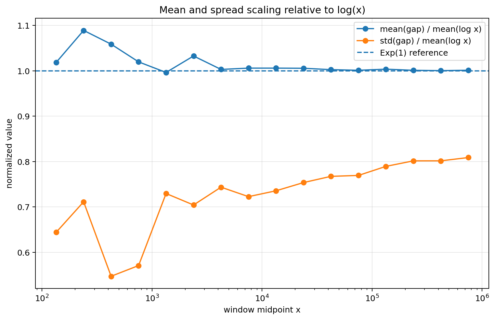
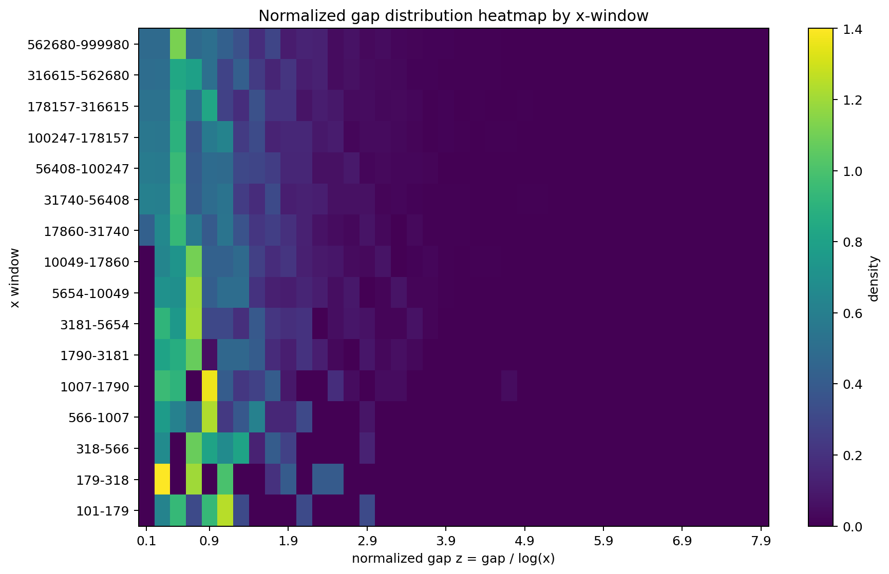
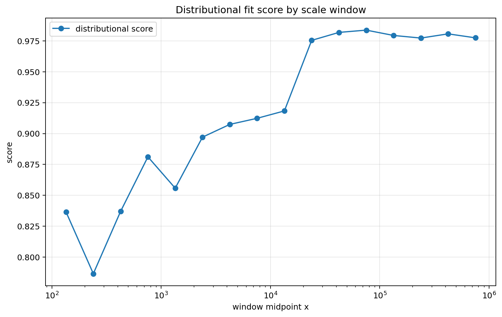
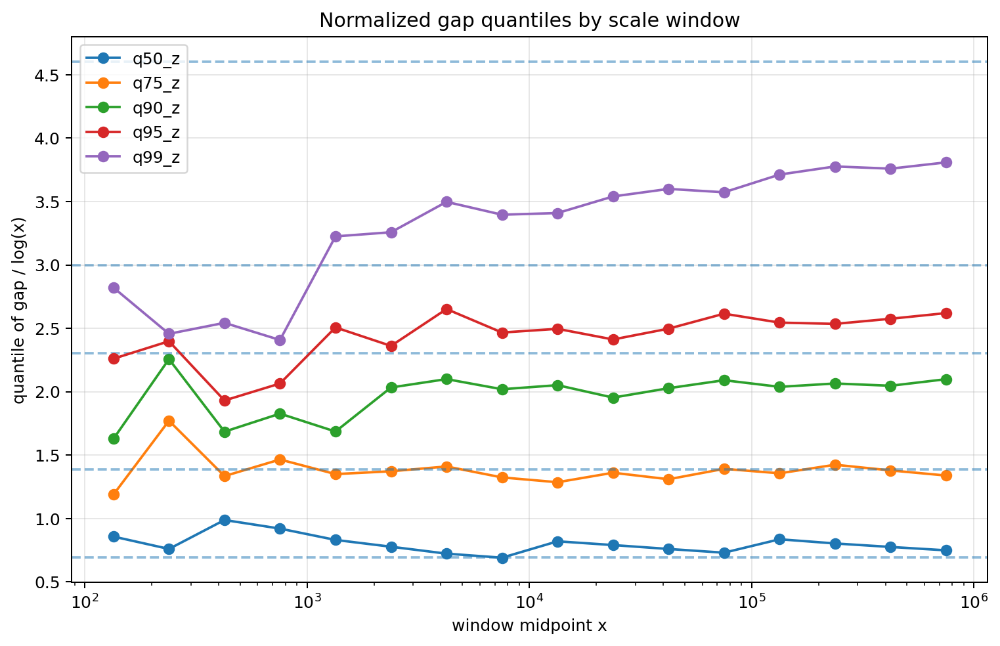
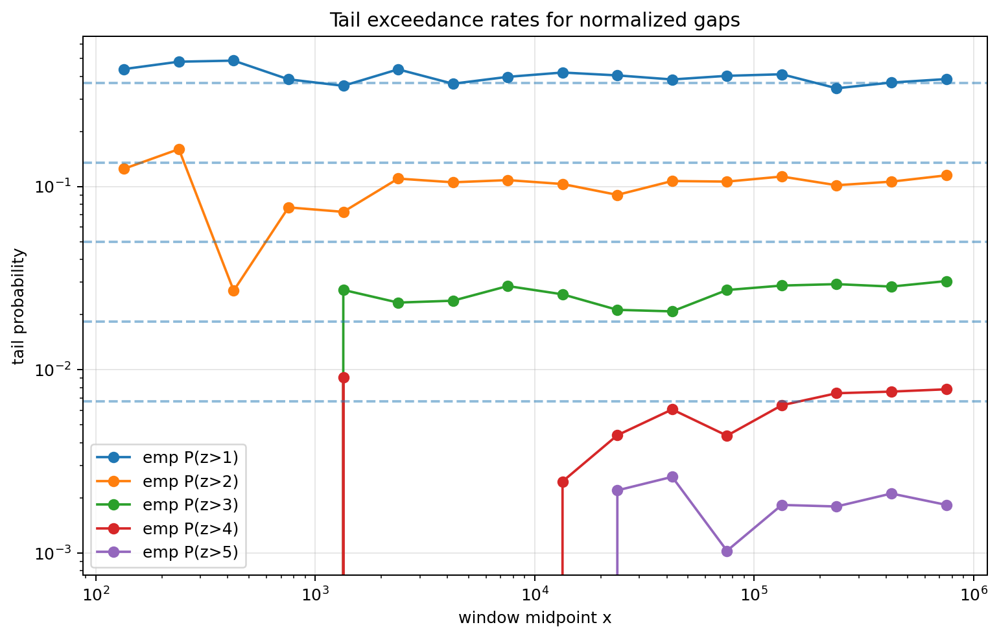
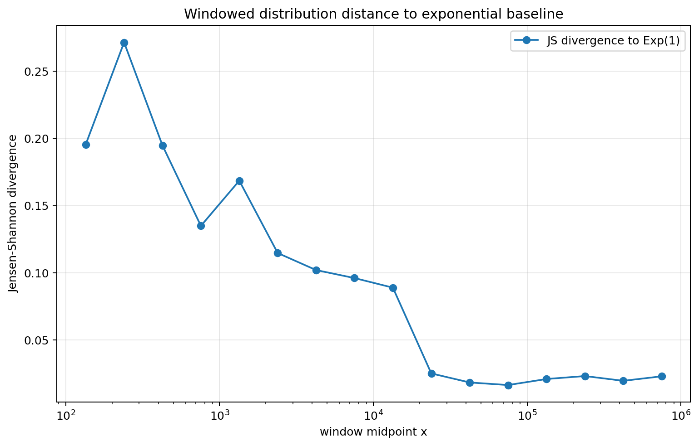

# Normalized Gap Distribution (Notebook 12)

## Constraint result

This notebook tests whether prime gaps become more stable after local scale normalization:

$$
z_n = \frac{p_{n+1} - p_n}{\log(p_n)}.
$$

The comparison baseline is:

$$
Z \sim \mathrm{Exp}(1).
$$

## Remains under constraint

The mean normalized gap remains close to 1 at larger scale windows:

$$
\frac{\mathbb{E}[g]}{\mathbb{E}[\log x]} \approx 1.
$$

This supports the expected log-scale normalization:

$$
g \sim \log x.
$$

## Drift

Distributional drift remains visible in quantiles, tails, and histogram shape. The distributional score is based on Jensen--Shannon divergence:

$$
CGCS = \frac{1}{1 + JS(P_{empirical}, P_{Exp(1)})}.
$$

Final-window CGCS score:

$$
CGCS_{final} = 0.977480.
$$

Mean distributional score:

$$
\overline{CGCS} = 0.918000.
$$

## Recoverability

The normalized-gap distribution becomes more comparable across scale windows after dividing by $\log(x)$. This indicates that gap shape is partially recoverable from a local scale correction, even when raw gaps grow with $x$.

## Caution

This notebook does not prove a theorem about prime gaps or the Riemann Hypothesis. It provides a reproducible empirical diagnostic for log-normalized gap structure and its distributional drift.

## Core result

The measurable result is:

$$
z = \frac{g}{\log(x)} \quad \text{has a scale-stabilized distribution with an exponential-style baseline.}
$$

## Summary

- gap size grows with local $\log(x)$ scale
- normalized mean stays near 1
- distributional fit generally improves across larger scale windows
- tails and quantiles preserve structured drift
- CGCS measures closeness to the exponential baseline

Constraint → signal > noise

## Figures

### Figure 1 — 12 Normalized Gap Histogram

### Figure 2 — 12 Normalized Gap Ecdf

### Figure 3 — 12 Mean Spread Scaling

### Figure 4 — 12 Normalized Gap Heatmap

### Figure 5 — 12 Distributional Fit Score

### Figure 6 — 12 Normalized Gap Quantiles

### Figure 7 — 12 Tail Exceedance Rates

### Figure 8 — 12 Js Divergence To Exp1

