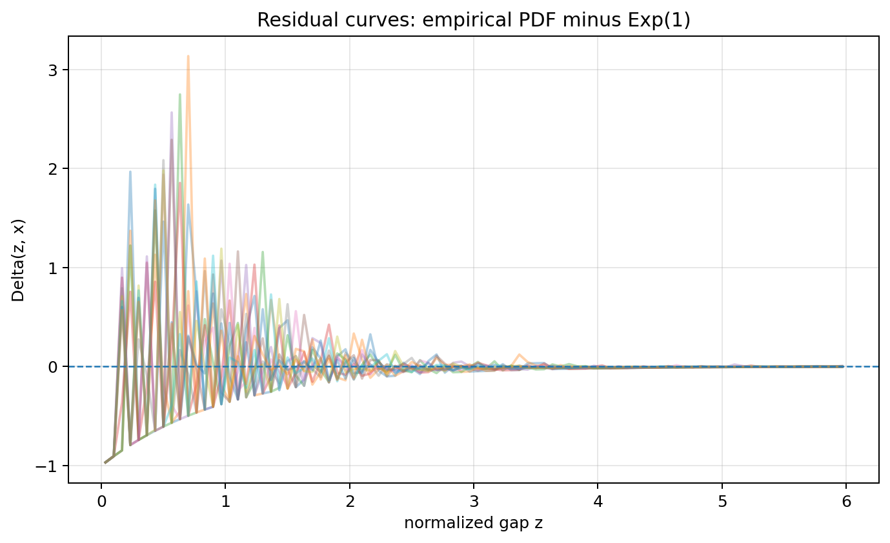
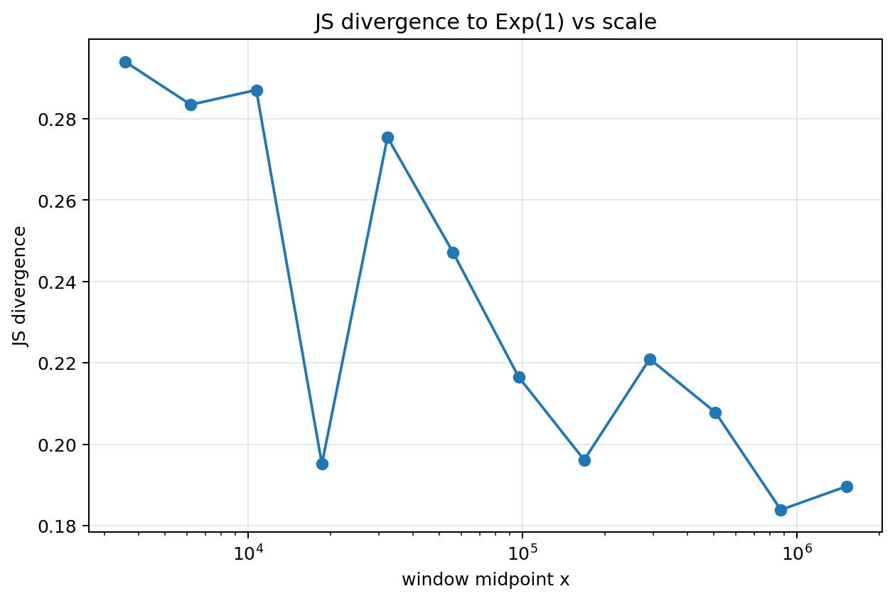
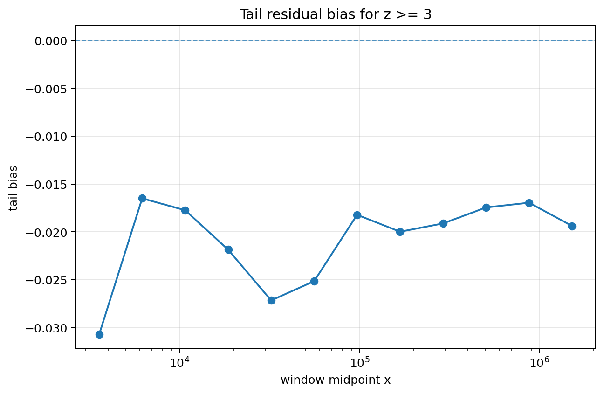
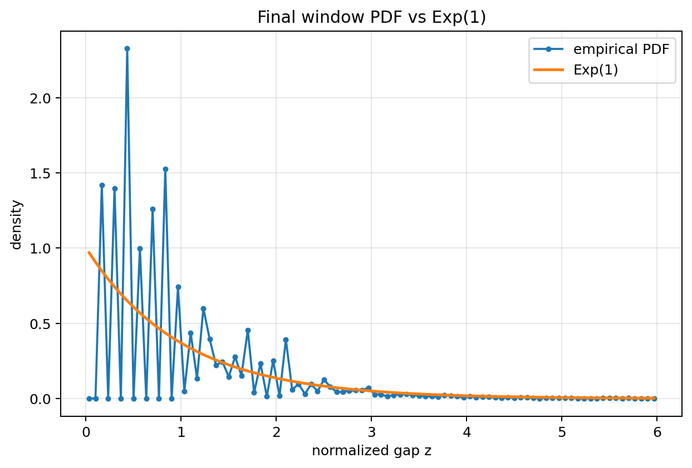
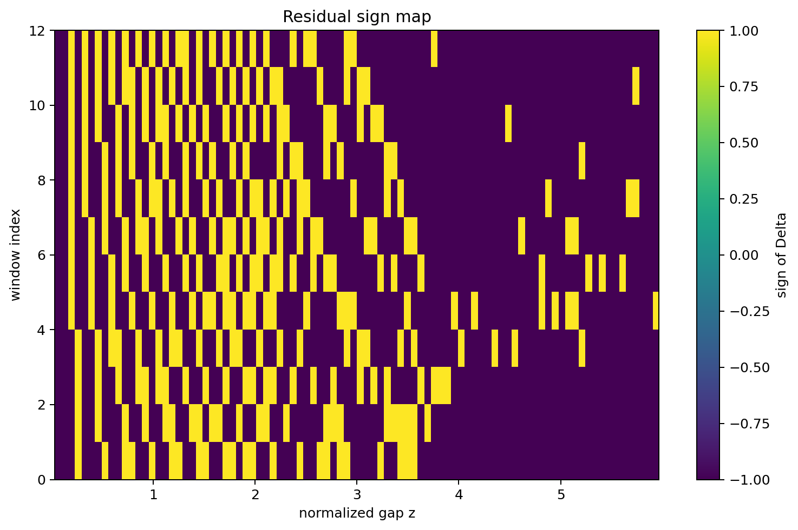

# Gap Distribution Residual Structure

## Constraint result

This notebook measures residual structure in normalized prime gaps after comparison to the exponential baseline.

The residual is:

$$
\Delta(z,x)=f_{emp}(z,x)-e^{-z}.
$$

## Remains under constraint

The exponential envelope remains visible after normalization by $\log p_n$.

The final-window divergence and residual norms remain finite and measurable:

- final residual L1 = 0.925666
- final residual L2 = 0.818646
- final JS divergence = 0.189657

## Drift

Drift is measured as structured residual deviation from $\mathrm{Exp}(1)$.

The residual is not treated as random noise. Positive and negative residual regions show where empirical density exceeds or falls below the exponential baseline.

## Tail bias

The tail-bias metric measures residual mass for $z \ge 3$:

- mean tail bias = -0.020848
- final tail bias = -0.019376

## Recoverability

Residual structure is recoverable as a windowed diagnostic:

- residual curves
- residual heatmap
- residual norm vs scale
- JS divergence vs scale
- tail bias

## CGCS score

The residual agreement score is:

$$
CGCS_\Delta = \frac{1}{1+\overline{\|\Delta\|_1}+\overline{JS}}.
$$

Measured score:

$$
CGCS_\Delta = 0.437662.
$$

## Caution

This notebook does not prove a new theorem about prime gaps.

It measures finite residual structure relative to the exponential heuristic.

## Figures

### Figure 1 — 13 Residual Curves

### Figure 2 — 13 Residual Heatmap

### Figure 3 — 13 Residual Norm Vs Scale

### Figure 4 — 13 Js Divergence Vs Scale

### Figure 5 — 13 Positive Negative Residual Mass

### Figure 6 — 13 Tail Bias Z Ge 3

### Figure 7 — 13 Final Window Pdf Vs Exp1

### Figure 8 — 13 Residual Sign Map

