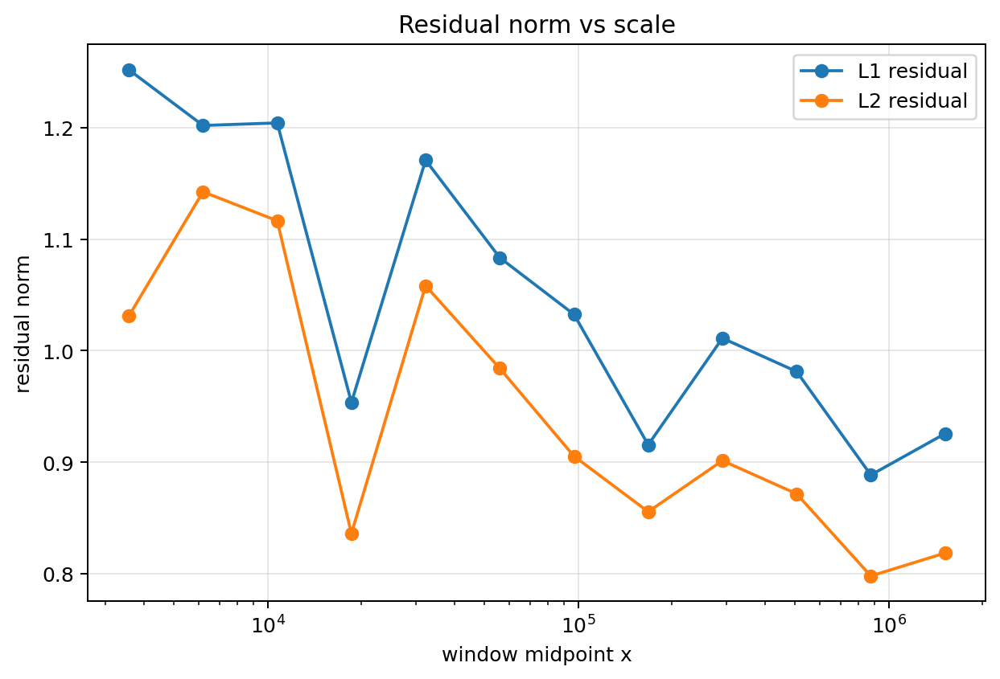
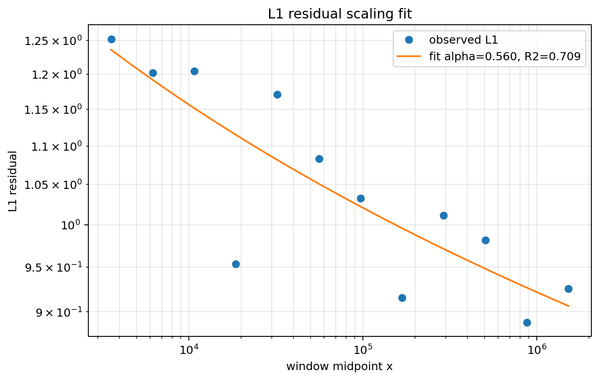
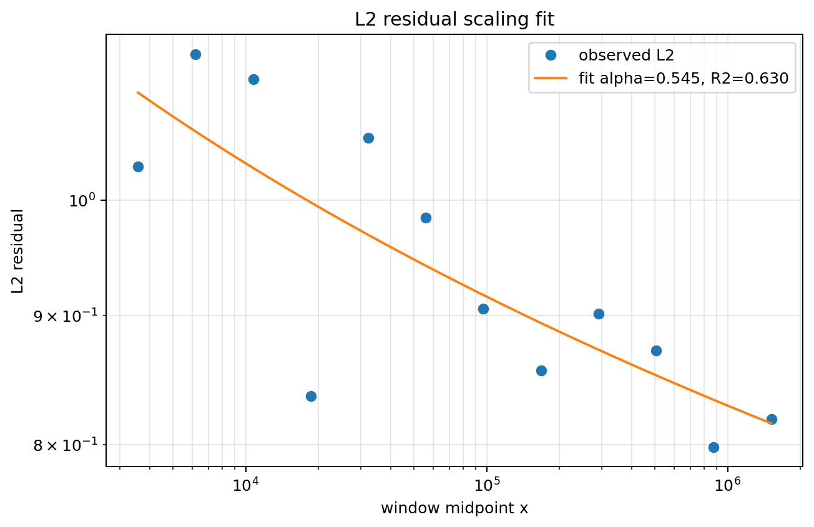
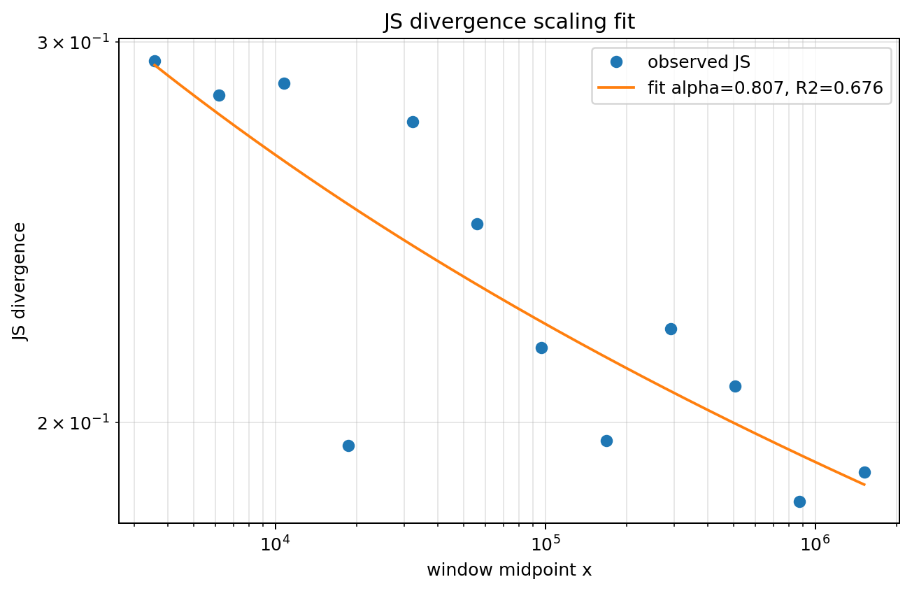
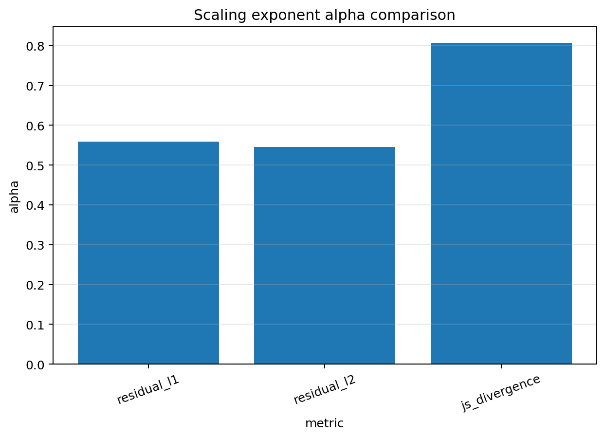
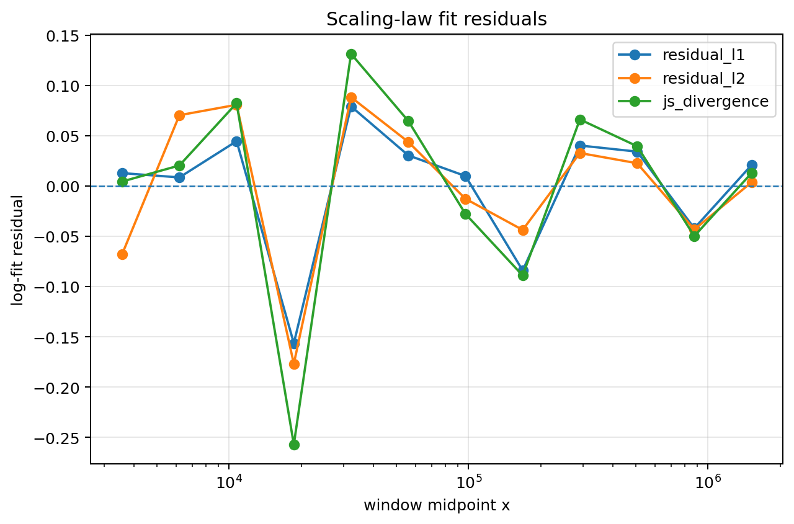
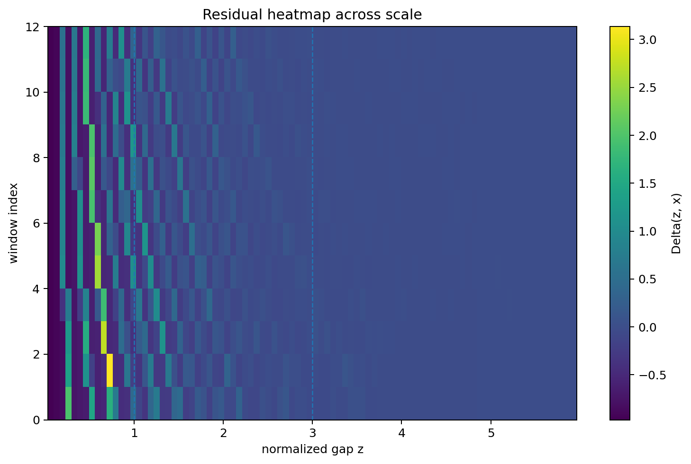
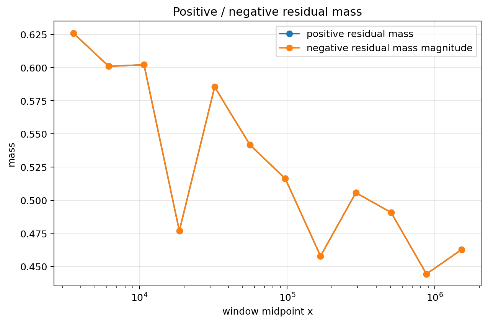
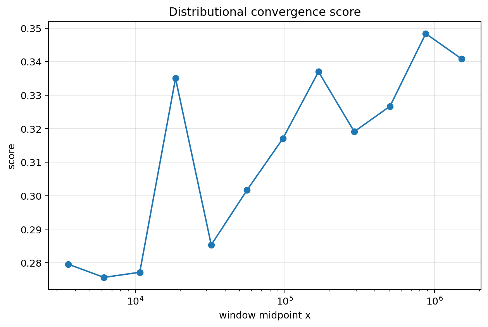

# Residual Scaling Law

## Constraint result

This notebook tests whether normalized prime-gap residuals decay by a log-scale law.

The fitted model is:

$$
\|\Delta(z,x)\| \sim C(\log x)^{-\alpha}.
$$

## Remains under constraint

The exponential envelope remains visible after normalization, and residual metrics can be fit by a compact scale model.

Fitted exponents:

- L1 alpha = 0.559588
- L2 alpha = 0.545420
- JS alpha = 0.806866

## Drift

Drift is measured by residual L1, residual L2, JS divergence, positive/negative residual mass, and tail bias.

## Recoverability

The residual trend is recoverable as a finite-scale diagnostic:

- residual norm vs scale
- log-scale power-law fit
- alpha comparison
- residual heatmap
- fit residuals

## CGCS score

The scaling agreement score is:

$$
CGCS_{scale} =
\frac{1}{1+\overline{\|\Delta\|_1}+\overline{JS}+\overline{|r_{fit}|}}.
$$

Measured score:

$$
CGCS_{scale} = 0.426777.
$$

## Caution

This notebook does not prove an asymptotic theorem.

It measures finite residual scaling relative to the exponential heuristic.

## Figures

### Figure 1 — 14 Residual Norm Vs Scale

### Figure 2 — 14 L1 Scaling Fit

### Figure 3 — 14 L2 Scaling Fit

### Figure 4 — 14 Js Scaling Fit

### Figure 5 — 14 Alpha Comparison

### Figure 6 — 14 Fit Residuals

### Figure 7 — 14 Residual Heatmap Across Scale

### Figure 8 — 14 Positive Negative Residual Mass

### Figure 9 — 14 Distributional Convergence Score

### Figure 10 — 14 Tail Residual Bias Z Ge 3

### Figure 11 — 14 Final Window Pdf Vs Exp1

