# Residue-Class Residual Decomposition

## Constraint result

This notebook decomposes normalized prime-gap residuals by residue class.

The residue-conditioned residual is:

$$
\Delta(z;r)=f_{emp}(z\mid r)-e^{-z}.
$$

## Remains under constraint

The exponential envelope remains visible globally, while residue-conditioned buckets retain structured finite deviations.

## Drift

The strongest anchor-residue class by L1 residual is:

- anchor residue mod30 = 19
- L1 residual = 1.002344
- JS divergence = 0.206592

The strongest gap-residue class by L1 residual is:

- gap residue mod30 = 0
- L1 residual = 1.817942
- JS divergence = 0.562370

The strongest transition by L1 residual is:

- transition = 1->1
- L1 residual = 1.839074
- JS divergence = 0.573645

## Recoverability

Residual structure is recoverable as a finite residue-class diagnostic:

- anchor residue residual mass
- gap residue residual mass
- transition residual mass
- windowed residue heatmaps
- strongest residue residual curves

## CGCS score

The residue agreement score is:

$$
CGCS_{residue} =
\frac{1}{1+\overline{\|\Delta_r\|_1}+\overline{JS_r}+\sigma(\|\Delta_r\|_1)}.
$$

Measured score:

$$
CGCS_{residue} = 0.458698.
$$

## Caution

This notebook does not prove an asymptotic theorem.

It measures finite residue-class residual structure relative to the exponential heuristic.

## Figures

### Figure 1 — 15 Anchor Mod30 Residual Mass

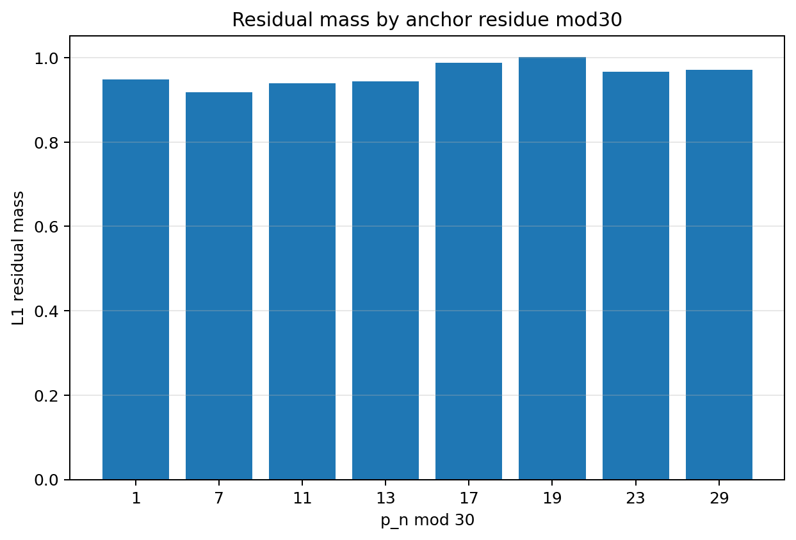

### Figure 2 — 15 Gap Mod30 Residual Mass

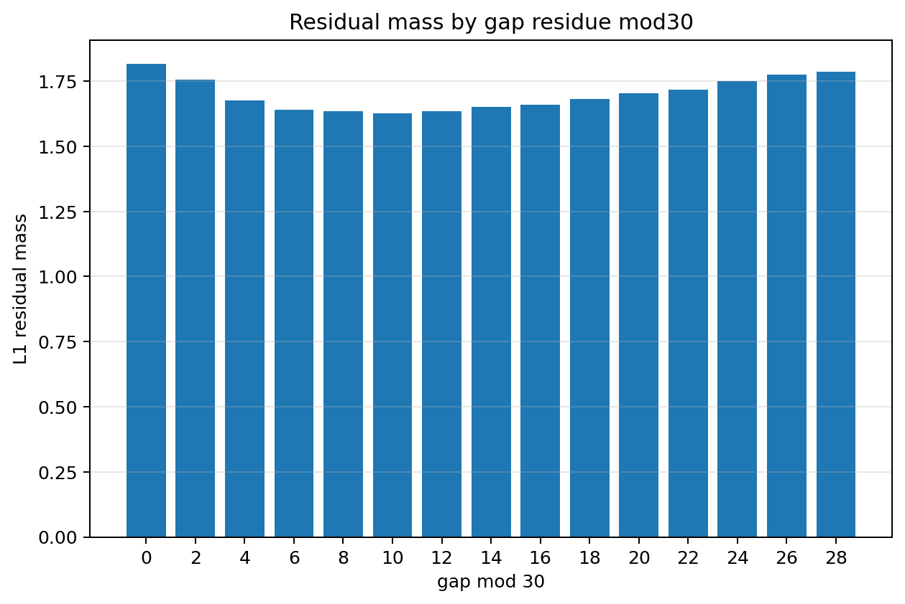

### Figure 3 — 15 Anchor Mod30 Js Divergence

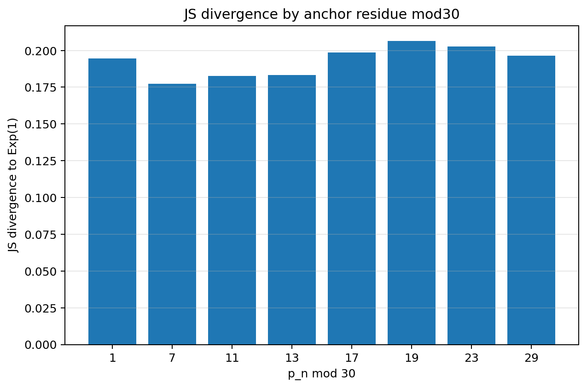

### Figure 4 — 15 Tail Exceedance By Anchor Mod30

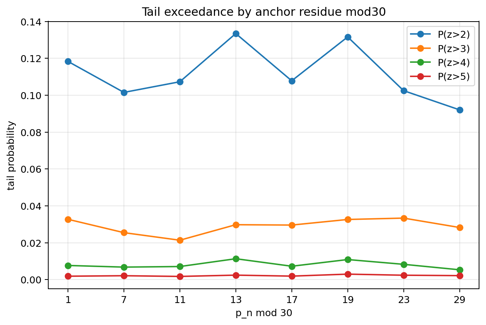

### Figure 5 — 15 Mean Z By Anchor Mod30

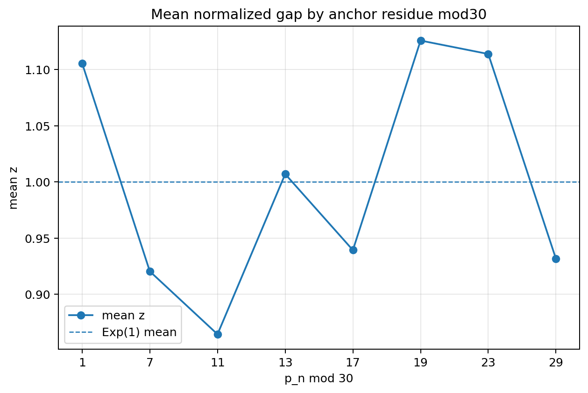

### Figure 6 — 15 Transition Mod30 Residual Mass Top20

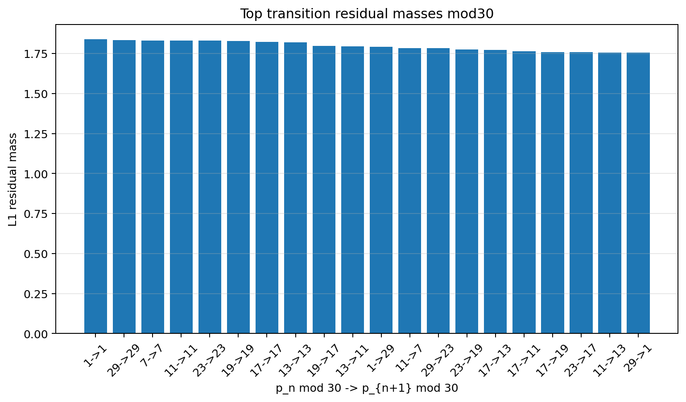

### Figure 7 — 15 Windowed Anchor Mod30 L1 Heatmap

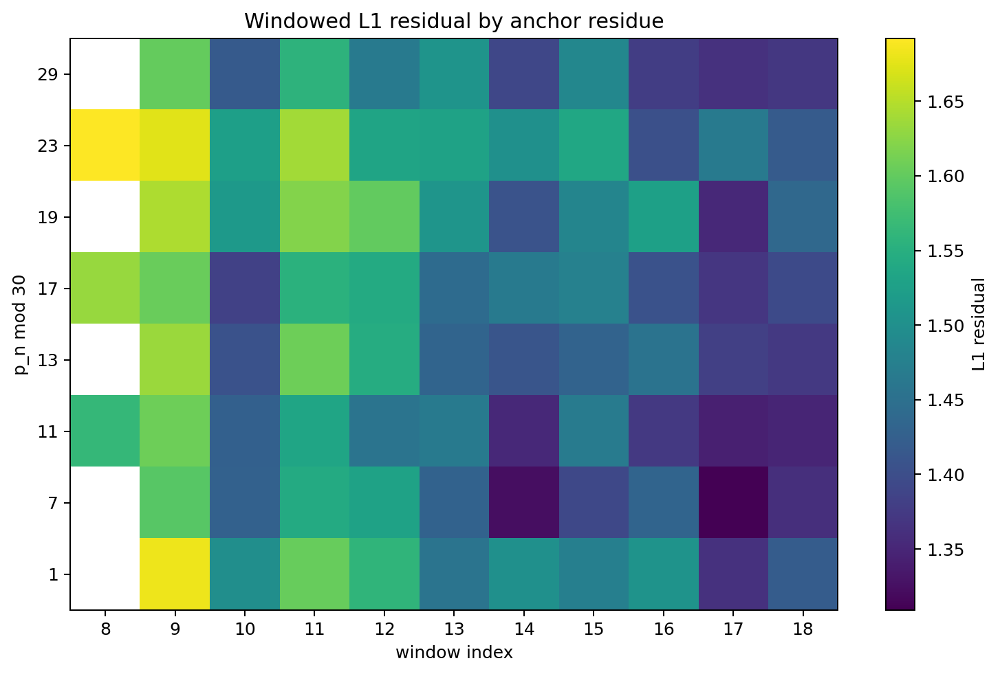

### Figure 8 — 15 Strongest Residue Residual Curves

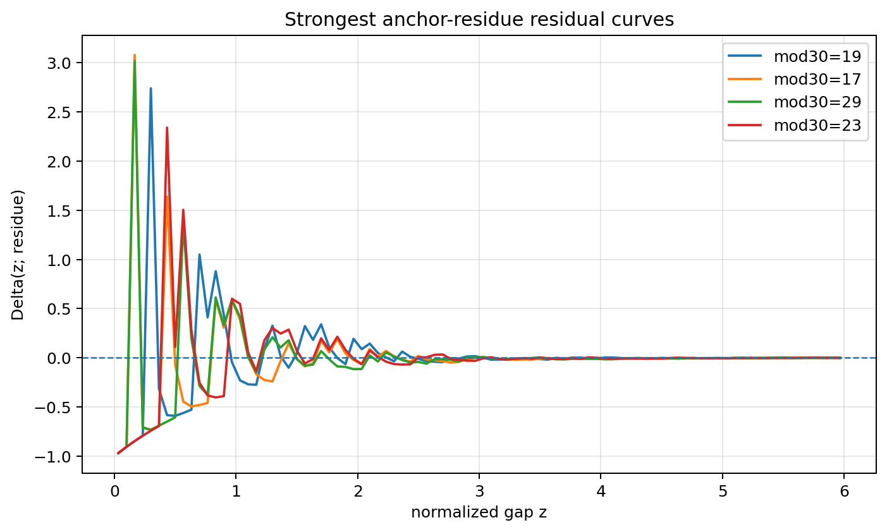

### Figure 9 — 15 Windowed Js Divergence Vs Scale

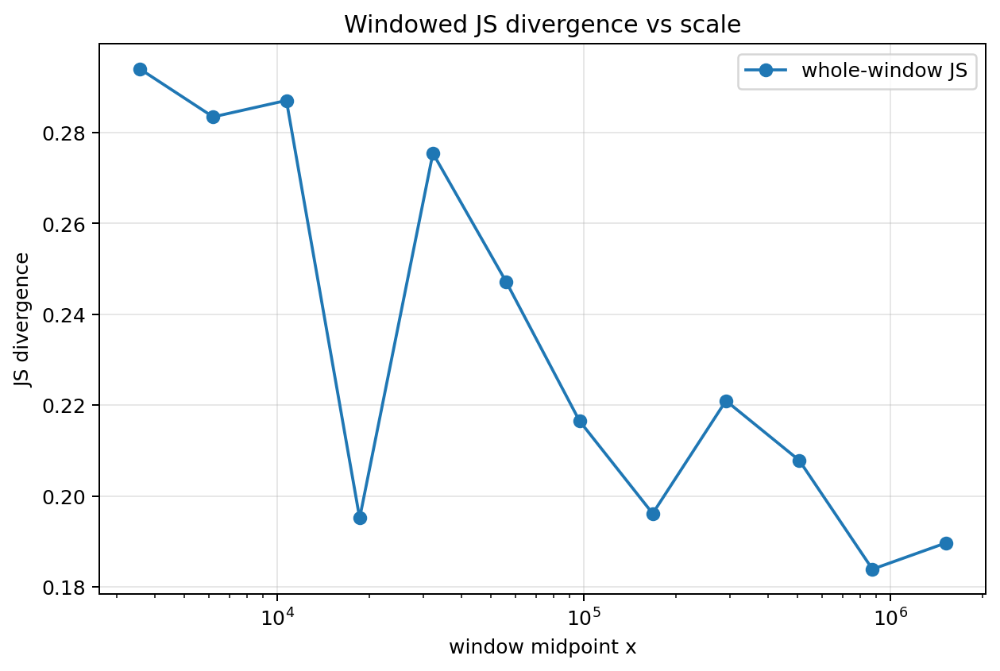

### Figure 10 — 15 Residue Concentration Score

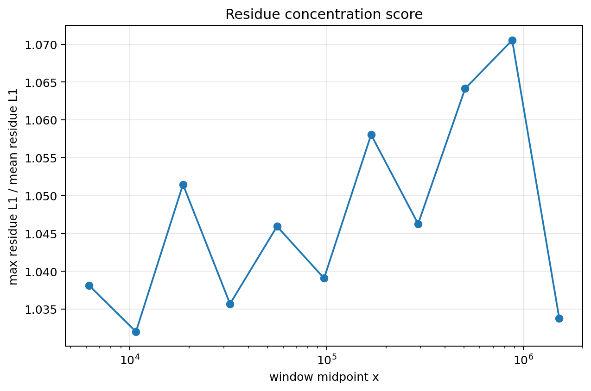

### Figure 11 — 15 Final Window Residue Pdfs Vs Exp1

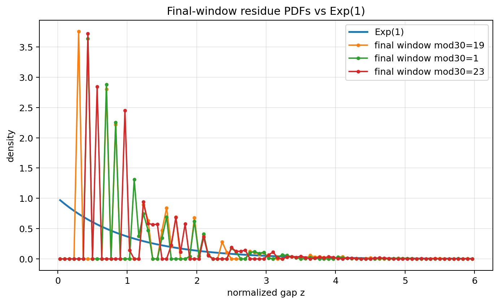

