# Transition Operator, Entropy, and Mixing

## Constraint result

This notebook models residue-class transitions as a finite transition operator.

The transition operator is:

$$
P_{ij} = \Pr(r_{n+1}=j \mid r_n=i).
$$

## Remains under constraint

Prime residue transitions form a high-entropy operator, meaning the next residue is broadly distributed for each anchor residue.

Measured values:

- mean transition entropy = 0.891853
- stationary L1 distance from uniform = 0.001533
- spectral gap proxy = 0.618900

## Drift

Drift appears as:

- transition lift above independent next-residue baseline
- residual-weighted transition mass
- transition-conditioned residual curves
- windowed transition-operator drift

Strongest lift transition:

- 17->19, lift = 2.312926

Strongest transition residual:

- 23->23, L1 = 1.831263

## Recoverability

The local structure is recoverable through:

- transition matrix
- entropy profile
- mixing profile
- lift matrix
- residual-weighted transition operator
- transition-conditioned residual curves

## CGCS score

The transition-mixing score is:

$$
CGCS_{transition} =
\frac{1}{1 + d(\pi,U) + (1-\overline{H}) + \lambda_2}.
$$

Measured score:

$$
CGCS_{transition} = 0.670789.
$$

## Caution

This notebook does not claim prime residues are generated by a first-order Markov chain.

It uses a finite transition operator as a measurement tool for local arithmetic memory.

## Figures

### Figure 1 — 16 Transition Operator Heatmap

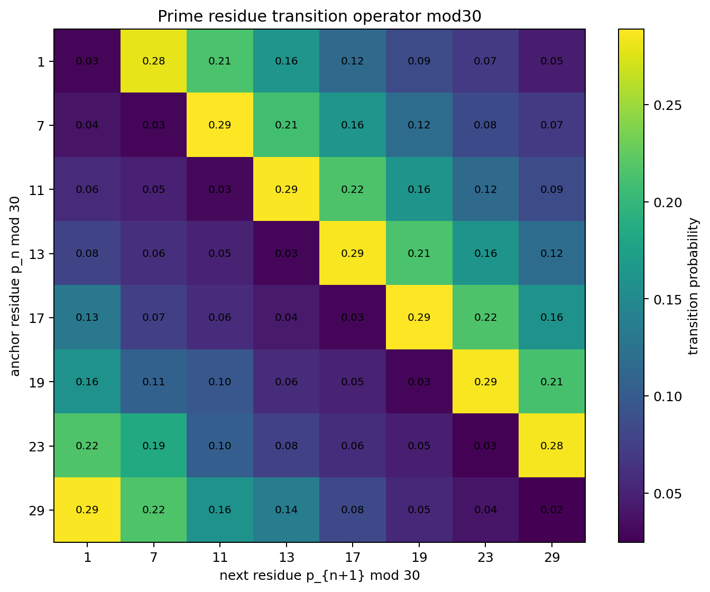

### Figure 2 — 16 Stationary Distribution

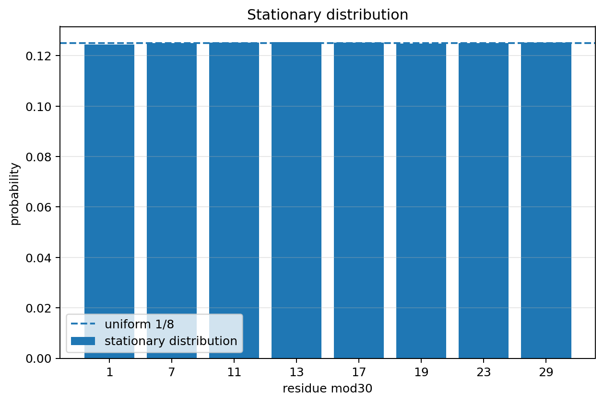

### Figure 3 — 16 Transition Entropy By Anchor

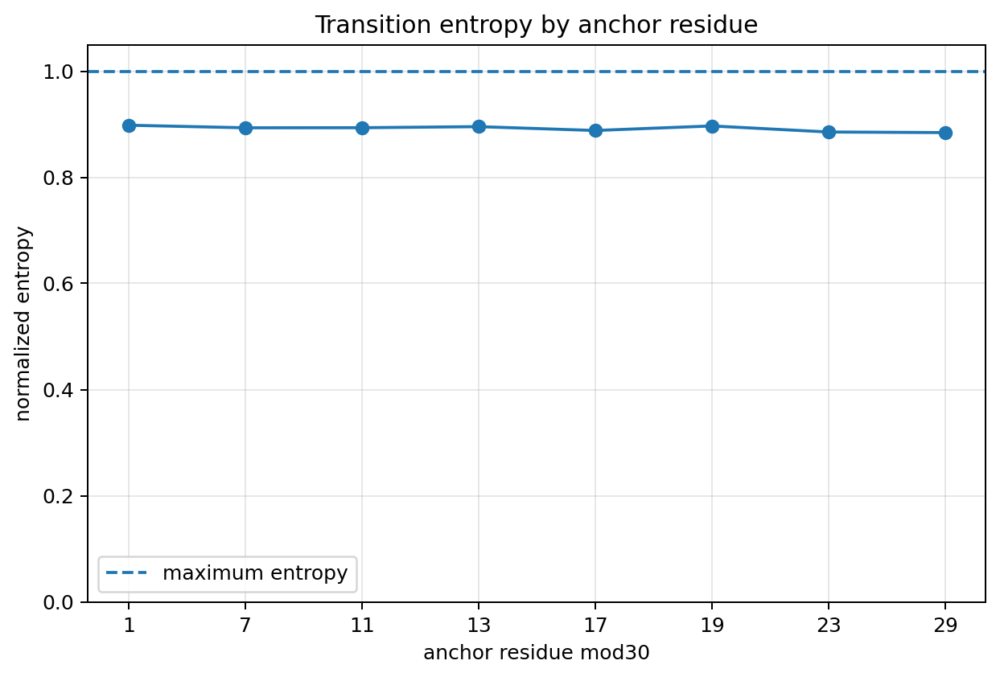

### Figure 4 — 16 Mixing Distance Vs Steps

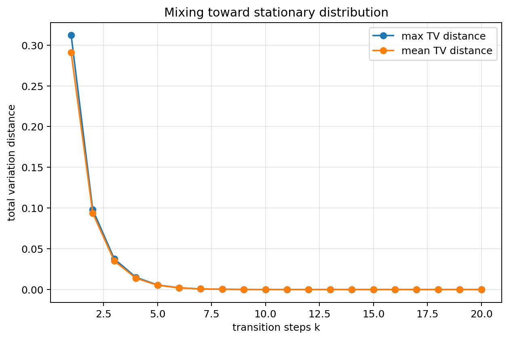

### Figure 5 — 16 Transition Eigenvalue Magnitudes

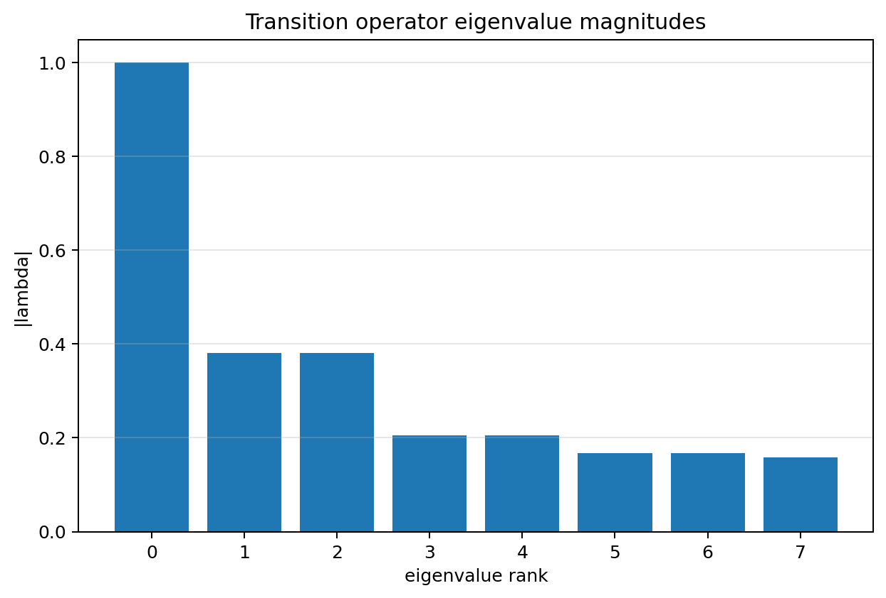

### Figure 6 — 16 Transition Lift Heatmap

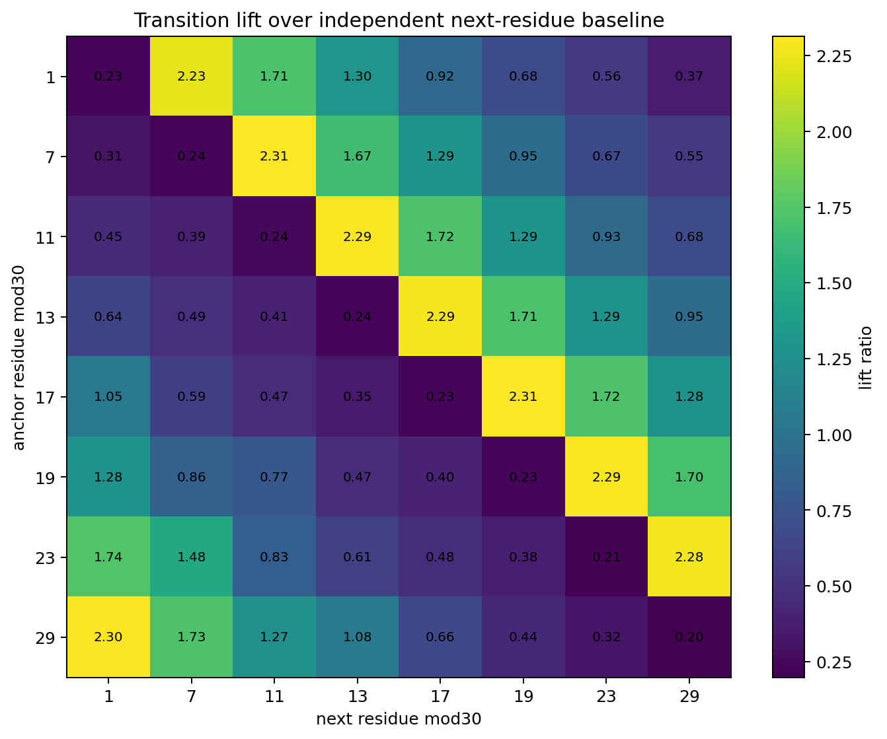

### Figure 7 — 16 Top Transition Residual Masses

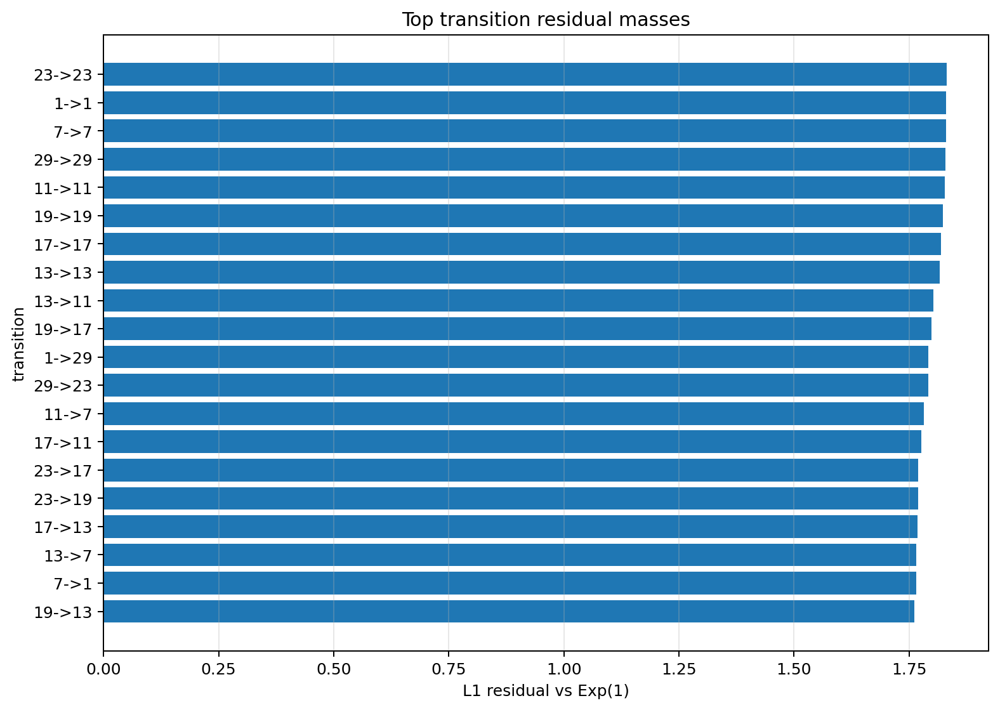

### Figure 8 — 16 Residual Weighted Transition Operator

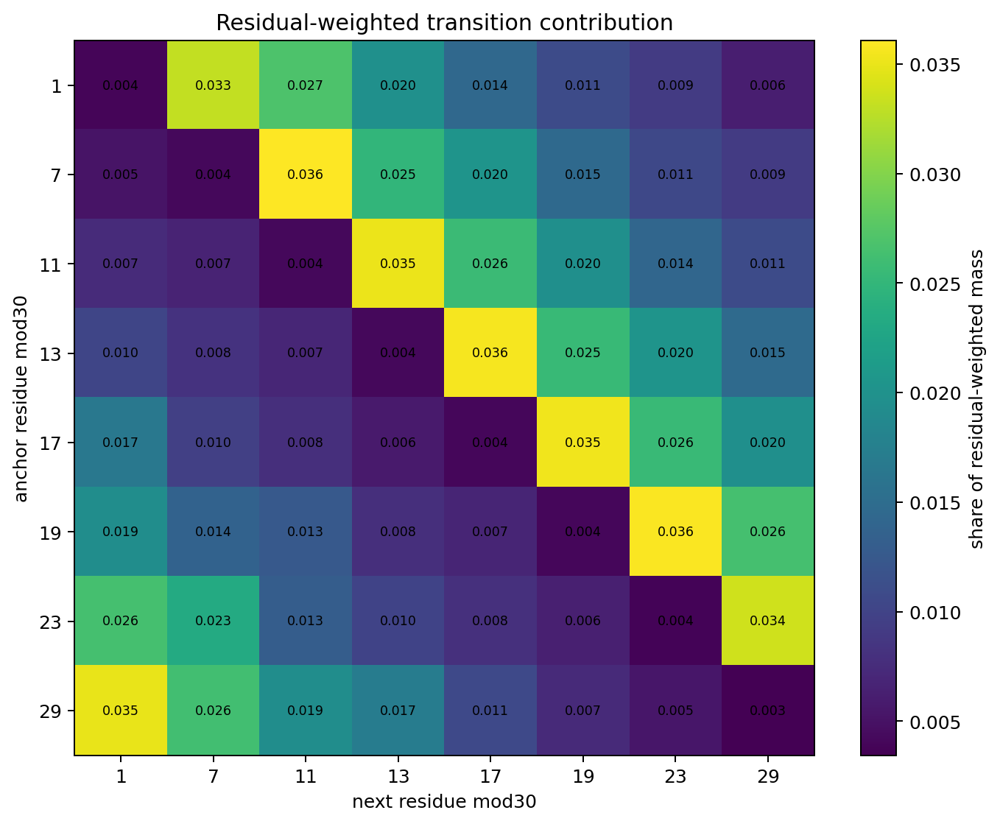

### Figure 9 — 16 Transition Conditioned Residual Curves

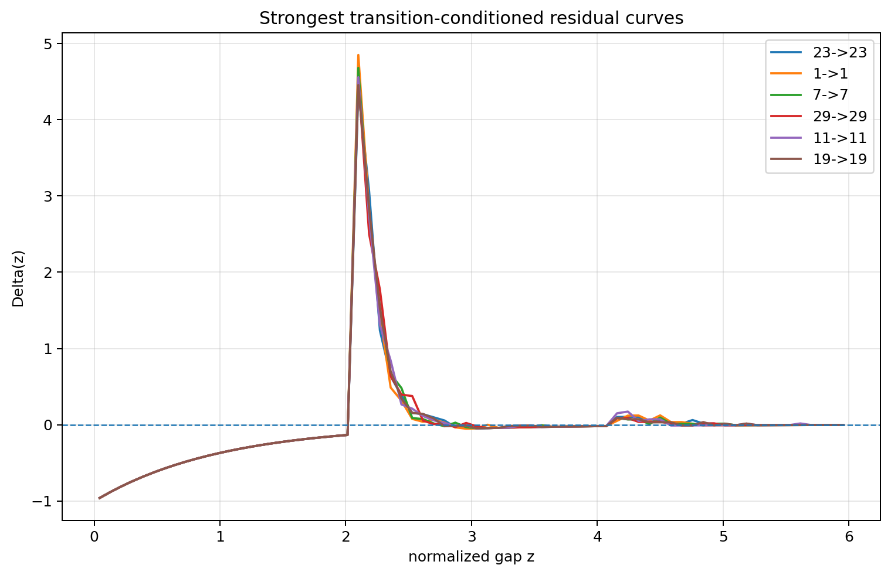

### Figure 10 — 16 Windowed Transition Operator Drift

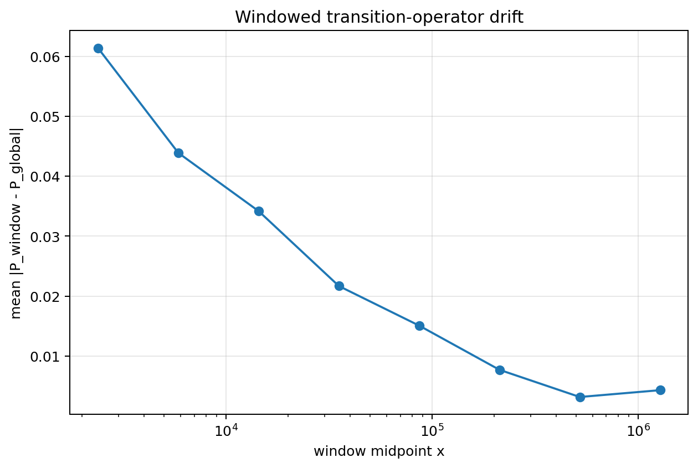

### Figure 11 — 16 Windowed Transition Entropy

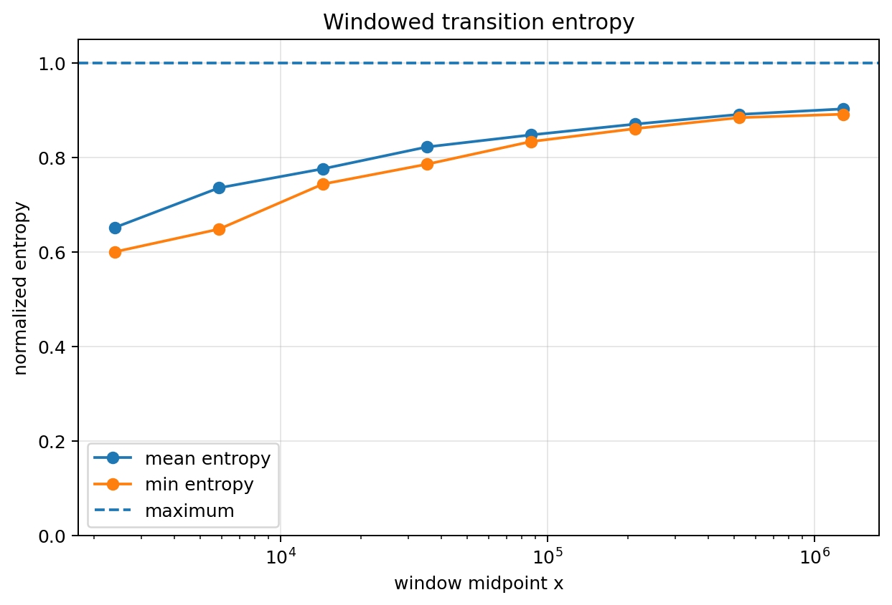

### Figure 12 — 16 Windowed Transition Delta Heatmap

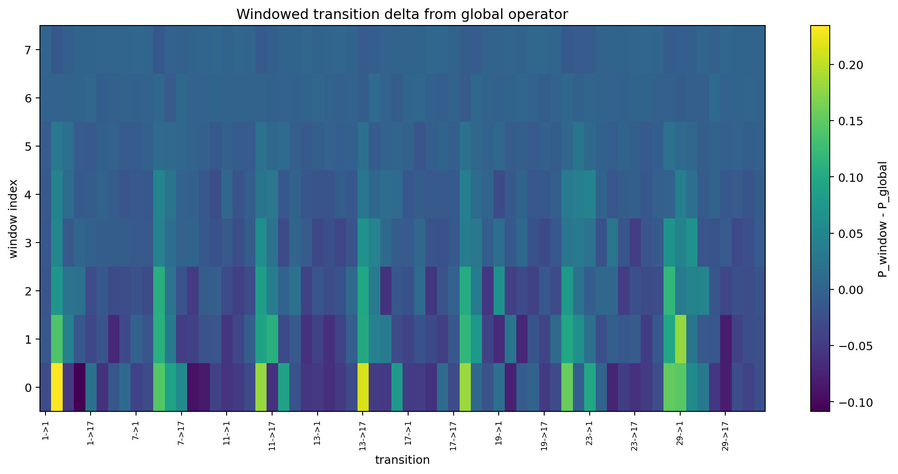

